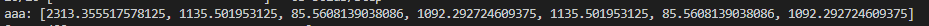

```
input1 = Input(shape=(3,)) 
x = Dense(5, activation='relu')(input1)
x = Dense(2)(x)
x = Dense(3)(x)
output1 = Dense(1)(x) 
```


 

layer를 x로 지정해줬음에도 summary를 보면 layer 이름이 정의된 것을 알 수 있음


keras.io

 

function: concatenate

Class: Concatenate


#### concatenate

   

원래 각 모델에서 마지막 output layer는 y의 col이여야 하지만, concatenate를 할 경우 어차피 마지막 layer가 merge1이라는 이름으로 생기므로 output layer 노드 수는 상관  없음


concatenate: 단순하게 엮임 -  그냥 두 모델이 마지막 layer에서 붙은 것 뿐

다른 방법은?

keras.io -> `merge` 검색


**최적의** Weight, **최소의** loss

W, loss를 찾기 위해 optimizer 사용


- keras13_ensemble2.py

 

loss1 = mse1 | loss2 = mse2 | loss3 = mse3

왜 같을까?

