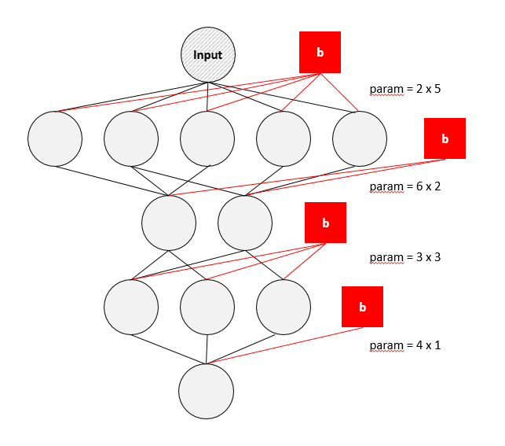

# keras01_1

> 참고
>
> - [https://talkingaboutme.tistory.com/entry/DL-%ED%95%B4%EB%B3%B4%EB%A9%B4%EC%84%9C-%EB%B0%B0%EC%9A%B0%EB%8A%94-%EB%94%A5%EB%9F%AC%EB%8B%9D-ANN-%EA%B5%AC%ED%98%84-3](https://talkingaboutme.tistory.com/entry/DL-해보면서-배우는-딥러닝-ANN-구현-3)
> - https://partrita.github.io/posts/regression-error/


#### 1. 데이터

```python
x = np.array([1,2,3,4,5,6,7,8,9,10])
y = np.array([1,2,3,4,5,6,7,8,9,10])
```


#### 2. 모델 구성

```python
from keras.models import Sequential
from keras.layers import Dense

model = Sequential()
model.add(Dense(10, input_dim = 1))
model.add(Dense(5))
model.add(Dense(1))
```

- `Sequential` 모델: 계층을 `선형`으로 쌓은 것

   

  - 첫 번째 계층에 `input_shape` 인수를 전달

    `input_shape`: 정수 / None(임의의 양의 정수) 값을 가질 수 있음

    `input_shape=(10,)` = `input_dim=10`

     

#### 3. 훈련

```python
model.compile(loss='mse', optimizer='Adam', metrics=['mse'])
model.fit(x, y, epochs=100, batch_size=5)
```

**compile**

- `optimizer`: neural network를 구성하는 알고리즘을 최적화 시켜주는 도구

  보통 `adam` 사용

- `loss`: 예측값과 실제값 간의 차이를 표현한 수식

  낮을수록 좋음

- `metrics`: 실제 화면상으로 출력되는 output

**fit**

- `epochs`: 전체 단위가 학습되는 횟수

- `batch_size`: 학습 반복 횟수 - 몇 문제마다 답지를 보여줄 것인지

  default = 32


#### 4. 평가 예측

```python
loss, mse = model.evaluate(x, y, batch_size=5)
print('mse: ', mse)
print('loss: ', loss)

x_prd = np.array([11,12,13])
aaa = model.predict(x_prd, batch_size=5)
print(aaa)
```


#### [plus] 회귀 오류 지표

회귀 오류 지표는 수치가 낮을수록 좋음

**1. MAE: Mean Absolute Error**

- 평균 절대 오차

 

**2. MSE: Mean Square Error**

- 평균 제곱 오차: 제곱을 하므로 예측값과 실제 값 차이의 면적의 합

 

**3. RMAE: Root MAE**

- compile 시 적용X

**4. RMSE: Root MSE** 

- 오류 지표를 실제 값과 유사한 단위로 다시 변환

- compile 시 적용X


# keras02_summary

#### 1. Hypothesis

- Linear Regression에서 사용하는 1차 방정식을 가리키는 용어

- H(x) = Wx + b

  `W`: 가중치 - 그래프의 기울기

  `b`: bias

- 만약 2차 방정식 형태로 데이터가 분포한다면 미분

  `y' = 2ax +b` = `y'=Wx+b`

  

#### 2. summary

```python
model.summary()
```

 