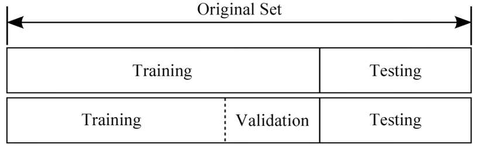

# keras03_test

#### 1. 데이터

train과 test 데이터 나누기

```python
x_train = np.array([1,2,3,4,5,6,7,8,9,10])
y_train = np.array([1,2,3,4,5,6,7,8,9,10])
x_test = np.array([11,12,13,14,15,16,17,18,19,20])
y_test = np.array([11,12,13,14,15,16,17,18,19,20])
```


#### 2. 모델 구성

`keras01_1.py`와 동일

```python
from keras.models import Sequential
from keras.layers import Dense

model = Sequential()
model.add(Dense(5, input_dim = 1))
model.add(Dense(2))
model.add(Dense(3))
model.add(Dense(1))
```

 

#### 3. 훈련

model.fit할 때, `x_train`, `y_train` 데이터를 훈련

```python
model.compile(loss='mse', optimizer='Adam', metrics=['mae'])
model.fit(x_train, y_train, epochs=100, batch_size=1)
```


#### 4. 평가 예측

model.evaluate를 할 때 `keras01_1.py`에서와 같이 훈련과 평가를 같은 데이터로 하는 것이 아니라, `x_test`, `y_test` 데이터를 통해 평가 예측

```python
loss, mse = model.evaluate(x_test, y_test, batch_size=1)
print('mae: ', mae)
print('loss: ', loss)

x_prd = np.array([21,22,23])
aaa = model.predict(x_prd, batch_size=1)
print(aaa)
```


# keras04_val

> 참고
>
> - https://3months.tistory.com/118


#### 1. 데이터

train, test, val로 나누기

- test vs validation

  test set: 모델의 최종 성능을 평가하기 위해 사용되며 training 과정에 관여하지 않음

  validation set: 최종 모델을 선정하기 위한 성능 평가에 관여. 즉 training 과정에 관여

```python
x_train = np.array([1,2,3,4,5,6,7,8,9,10])
y_train = np.array([1,2,3,4,5,6,7,8,9,10])
x_test = np.array([11,12,13,14,15,16,17,18,19,20])
y_test = np.array([11,12,13,14,15,16,17,18,19,20])
x_val = np.array([101,102,103,104,105])
y_val = np.array([101,102,103,104,105])
```

 


#### 2. 모델 구성

`keras01_1.py`와 동일

```python
from keras.models import Sequential
from keras.layers import Dense

model = Sequential()
model.add(Dense(5, input_dim = 1))
model.add(Dense(2))
model.add(Dense(3))
model.add(Dense(1))
```

 

#### 3. 훈련

`keras03_test.py`에서는 fit할 때 validation_data를 넣지 않았지만, `keras04_val.py`에서는 validationi_data 변수에 x_val, y_val 데이터를 넣어줌

```python
model.compile(loss='mse', optimizer='Adam', metrics=['mae'])
model.fit(x_train,y_train,epochs=100, batch_size=1, validation_data=(x_val,y_val))
```


#### 4. 평가 예측

`keras03_test.py`와 동일

```python
loss, mae = model.evaluate(x_test,y_test, batch_size=1)
print('mae:' , mae)
print('loss:' , loss)

x_prd = np.array([21,22,23])
aaa = model.predict(x_prd, batch_size=1)
print(aaa)
```