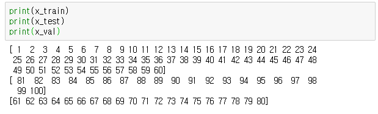

# keras05_split

#### 1. 데이터

이전보다 더 많은 데이터를  x,y로 정의 후 6:2:2로 split

```python
x = np.array(range(1,101))
y = np.array(range(1,101))

x_train = x[:60]
y_train = y[:60]
x_test = x[60:80]
y_test = y[60:80]
x_val = x[80:100]
y_val = y[80:100]
```


# keras06_split2

####  1. 데이터

`keras05_split.py`처럼 자르는 것이 아니라 `train_test_split` 함수를 사용

- `shuffle`: 데이터를 섞을지 말지 결정

```python
x = np.array(range(1,101))
y = np.array(range(1,101))

x_train, x_test, y_train, y_test = train_test_split(x, y, test_size=0.4, shuffle=False)
x_val, y_train, y_val, y_test = train_test_split(y_train, y_test, test_size=0.5, shuffle=False)
```

  


# keras07_RMSE

#### 1. RMSE function

값이 낮을수록 오차가 작음

```python
y_predict = model.predict(x_test, batch_size=1)

from sklearn.metrics import mean_squared_error

def RMSE(y_test, y_predict):
    retrun np.sqrt(mean_squared_error(y_test, y_predict))
    #np.sqrt: root
    
print("RMSE: ", RMSE(y_test, y_predict))
```


# keras08_R2

#### 1. R2 function

오차가 클수록 `0`에 가깝고 오차가 작을수록 `1`에 가까워짐

```python
y_predict = model.predict(x_test, batch_size = 1)

from sklearn.metrics import r2_score

r2_y_predict = r2_score(y_test, y_predict)
print("R2: ", r2_y_predict)
```