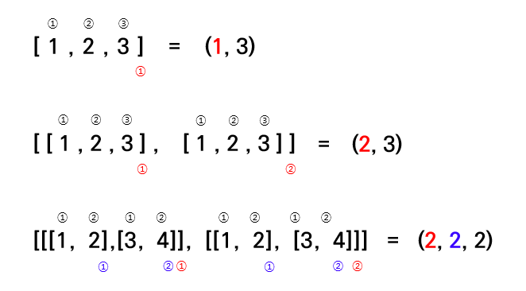

# keras09_mlp

#### 1. 데이터

(2,10)을 (10,2) 행렬로 변경

- `np.transpose()`

```python
x = np.array([range(1,101), range(101,201)])
y = np.array([range(1,101), range(101,201)])

x= np.transpose(x)
y= np.transpose(y)

from sklearn.model_selection import train_test_split
x_train, x_test, y_train, y_test = train_test_split(x, y, test_size=0.4,shuffle=False) 
x_test, x_val, y_test, y_val = train_test_split(x_test, y_test, test_size=0.5, shuffle=False)
```

- 행렬

   

  

#### 2. 모델 구성

이제 행렬이 (10,2)이므로 `input_dim` 은 1에서 2로 변경

```python
from keras.models import Sequential
from keras.layers import Dense

model = Sequential()
model.add(Dense(28, input_dim = 2))
model.add(Dense(14))
model.add(Dense(21))
model.add(Dense(2))
```


#### 3. 훈련

```python
model.compile(loss='mse', optimizer='Adam', metrics=['mse'])
model.fit(x_train, y_train, epochs=200, batch_size=1, validation_data=(x_val, y_val))
```


#### 4. 평가 예측

```python
loss, mse = model.evaluate(x_test,y_test, batch_size=1)
print('mse:' , mse)
print('loss:' , loss)

x_prd = np.array([[501,502,503],[504,505,506]]) #(2,3)
x_prd = np.transpose(x_prd) #(2,3)을 (3,2)로
aaa = model.predict(x_prd, batch_size=1)
print(aaa)
```


# keras10_mlp2

#### 1. 데이터

```python
x = np.array([range(1,101), range(101,201), range(301,401)]) #shape: (3, 100)
y = np.array([range(101,201)]) #shape: (1, 100)

x = np.transpose(x) #shape: (100,3)
y = np.transpose(y) #shape: (100,1)

x_train, x_test, y_train, y_test = train_test_split(x, y, test_size=0.4, shuffle=None)
x_test, x_val, y_test, y_val = train_test_split(x_test, y_test, test_size=0.5, shuffle=None)
```


#### 2. 모델 구성

```python
from keras.models import Sequential
from keras.layers import Dense

model = Sequential()

model.add(Dense(10, input_dim=3))
model.add(Dense(4))
model.add(Dense(5))
model.add(Dense(3))
```


#### 3. 훈련

```python
model.compile(loss='mse', metrics=['mae'], optimizer='Adam')
model.fit(x_train, y_train, epochs=100, batch_size=100, validation_data=(x_val,y_val))
```


#### 4. 평가 예측

```python
loss, mae = model.evaluate(x_test, y_test, batch_size=1)
print('mae:' , mae)
print('loss:' , loss)

x_prd = np.array([501,502,503], [504,505,506], [507,508,509])
x_prd = np.transpose(x_prd)
aaa = model.predict(x_prd, batch_size =1)
print(aaa)
```

