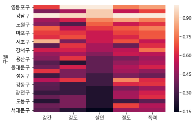

# 파이썬 정형 데이터 분석 및 시각화

## 3 . 서울시 범죄현황 통계자료 분석 및 시각화

> 1. 관서별 5대 범죄 발생 및 검거 파일을 활용해, 각 구의 경찰서마다의 검거율을 계산함
>
> 2. 데이터 분석을 바탕으로 수치 시각화를 진행 + 구글 지도를 활용한 시각화

### 1. 데이터 입력 및 데이터 전처리

#### 1-(1) 엑셀 데이터 삽입 및 정리 

- import

  ```python
  import numpy as np
  import pandas as pd
  import seaborn as sns
  
  import matplotlib.pyplot as plt
  from matplotlib import font_manager, rc
  ```

  - `matplotlib`: 파이썬 라이브러리 중 **데이터 시각화 라이브러리**로, 주로 numpy와 결합하여 여러 데이터를 그래프와 같은 시각 자료로 변환 및 출력해주어, 데이터를 가시적으로 확인할 수 있도록 도와줌

    다양한 그래프를 지원하며 Pandas와 연동 가능

  - `seaborn`: matplotlib을 기반으로 다양한 색상 테마와 통계용 차트 등의 기능을 추가한 **시각화 패키지**

- 엑셀 파일 읽기

  ```python
  df = pd.read_excel('관서별 5대범죄 발생 및 검거.xlsx', encoding='utf-8')
  ```


#### 1-(2) 경찰서를 구별로 정리

관서명을 기준으로 어느 구인지 '구별'열 추가

```python
police_to_gu = {'서대문서': '서대문구', '수서서': '강남구', '강서서': '강서구', '서초서': '서초구',
                '서부서': '은평구', '중부서': '중구', '종로서': '종로구', '남대문서': '중구',
                '혜화서': '종로구', '용산서': '용산구', '성북서': '성북구', '동대문서': '동대문구',
                '마포서': '마포구', '영등포서': '영등포구', '성동서': '성동구', '동작서': '동작구',
                '광진서': '광진구', '강북서': '강북구', '금천서': '금천구', '중랑서': '중랑구',
                '강남서': '강남구', '관악서': '관악구', '강동서': '강동구', '종암서': '성북구', 
                '구로서': '구로구', '양천서': '양천구', '송파서': '송파구', '노원서': '노원구', 
                '방배서': '서초구', '은평서': '은평구', '도봉서': '도봉구'}

df['구별'] = df['관서명'].apply(lambda x: police_to_go.get(x, '구 없음'))
```

- 관서별 데이터를 구별 데이터로 정리

  한 구에 있는 여러 경찰서의 범죄 발생율과 검거율을 구를 기준으로 합침

  구가 없는 행은 삭제 진행

  ```python
  gu_df = pd.pivot_table(df, index='구별', aggfunc=np.sum)
  gu_df = gu_df.drop(['구 없음'])
  ```


#### 1-(3) 범죄별로 검거율 계산하기

- 발생건수 대비 검거건수를 `검거율`이라는 새 열에 삽입 

  삽입 후 필요없어진 열 제거

  ```python
  gu_df['강도검거율'] = gu_df['강도(검거)']/gu_df['강도(발생)']*100
  #강간, 살인,절도, 폭력, 검거율 동일
  
  del gu_df['강간(검거)']
  #검거열 다 제거
  ```

- 검거율이 100보다 큰 경우, 100으로 맞춰주기

  데이터 정규화를 하기 위함
  
  ```python
  columns = ['강간검거율', '강도검거율', '살인검거율', '절도검거율', '폭력검거율']
  gu_df_rate = gu_df[columns]
  
  for row_index, row in gu_df_rate.iterrows():
  	for column in columns:
  		if row[column] > 100:
			gu_df.at[row_index, column] = 100
  ```

- 검거 열을 검거율 열로 만들었으므로 범죄별 발생 데이터의 이름을 보기 쉽게 `범죄명[발생] -> 범죄명`으로 변경

  ```python
  gu_df.rename(columns = {'강간(발생)':'강간' #강도, 살인, 절도, 폭력 열 동일}, inplace = True)
  #inplace: 덮어쓰기 옵션
  ```

  

#### 1-(4) 인구 데이터 merge 하기

- excel 파일 읽기

  ```python
  popul_df = pd.read_csv('pop_kor.csv', encoding = 'UTF-8')
  ```

- 범죄 발생 및 검거율 데이터 `pd_df`와 인구 데이터 `popul_df` merge

  ```python
  gu_df = gu_df.join(popul_df)
  ```
  - `merge()`로도 합병 가능
  
    ```python
    df_a와 df_b를 합병하고 싶을 때
    result_df = pd.merge(df_a, df_b, left_on='고객번호', right_on='고객 고유번호')
    ```
  
    

### 2. 데이터 살펴보기 (Data exploration)

#### 2-(1) 검거율을 기준으로 정렬

- 오름차순 정렬

  ```python
  gu_df.sort_values(by = '검거율', ascending = True, inplace = True)
  #inplace: 덮어쓰기 옵션 - False: 내림차순
  ```

  

#### 2-(2) 범죄율 발생 건수 정규화하기 (범죄별로 많이 발생한 구가 1 == 100%)

- 5대 범죄별 수치를 해당 범죄별 최대값으로 나눠줌

  ```python
  target_col = ['강간', '강도', '살인', '절도', '폭력']
  weight_col = gu_df[target_col].max()
  
  crime_count_norm = gu_df[target_col]/weight_col
  ```


#### 2-(3) 한글 데이터 시각화를 위한 준비

- 수치 시각화 설정 및 한글 문제 해결

  ```python
  %matplotlib inline
  
  font_name = font_manager.FontProperties(fname="c:/Windows/Fonts/malgun.ttf").get_name()
  rc('font', family=font_name)
  ```

  - `%matplotlib inline `

    IPython에서 제공하는 `Rich output`에 대한 표현 방식을 jupyter notebook을 실행한 브라우저에서 바로 볼 수 있도록 해줌

    `Rich output`: 도표와 같은 **그림, 소리, 애니메이션**과 같은 결과물


#### 2-(4) 데이터 시각화

- 구별 살인 발생 순위 살펴보기

  ```python
  sns.heatmap(crime_count_norm.sort_values(by = '살인', ascending=False))
  ```

   


#### 2-(5) 데이터 시각화(2)

- 범죄율을 인구수로 나눠 인구대비 발생비율로 살펴보기

  인구수가 많을수록 범죄가 많이 일어나므로 단순히 범죄 건수로만 발생율을 볼 것이 아니라 인구수를 고려

  ```python
  crime_ratio = crime_count_norm.div(gu_df['인구수'], axis='index') * 100000
  
  # 인구수 단위인 10만을 곱해줌 - 강서구 강간=9.795665e-07에서 0.x까지 올리기
  ```

- 인구수 대비 구별 살인 발생율 순위 확인

  ```python
  plt.figure(figsize = (10, 10))
  
  sns.heatmap(crime_ratio.sort_values(by='살인', ascending=False), annot=True, fmt='f', linewidths=.5, cmap='Reds')
  plt.title('범죄 발생(살인발생으로 정렬) - 각 항목을 정규화한 후 인구로 나눔')
  plt.show()
  ```

   

- 각 구마다 5가지 범죄 발생 수치의 평균

  ```python
  crime_ratio['전체발생비율'] = crime_ratio.mean(axis=1)
  ```

- 정규화한 데이터의 시각화

  ```python
  plt.figure(figsize = (10, 10))
  
  sns.heatmap(crime_ratio.sort_values(by='전체발생비율', ascending=False), annot=True, fmt='f', linewidths=.5, cmap='Reds')
  plt.title('범죄 발생(전체발생비율로 정렬) - 각 항목을 정규화한 후 인구로 나눔')
  plt.show()
```
  
  

### 3. 지도 시각화

> - 지도 시각화: Folium Library 활용
>
> - 지도 데이터:  https://github.com/southkorea/southkorea-maps에서 서울만 따로 추린 GeoJSON 데이터 활용
>
>   (southkorea-maps/kostat/2013/json/skorea_municipalities_geo_simple.json)
>
>   `GeoJSON`: JSON 데이터 형식을 활용한 공간 데이터 교환 포맷 - Feature는 `point`(주소와 위치), `line strings`(길, 고속도로, 경계), `polygons`(도시, 지방, 토지) 그리고 이러한 유형의 여러 부분으로 구성된 컬렉션을 포함한다. Feature 컬렉션은 Feature의 집합으로 구성된다.
>
>   *참고:  https://goo.gl/GL2F2w*

#### 3-(1) 설정

- Folium Library 설치

  ```python
  !pip install folium
  ```

  ```python
  !pip install --index-url=http://pypi.python.org/simple/
  ```

  ```python
  !conda config --set ssl_verify false
  ```

  ```python
  !conda install folium
  ```

- 지도 데이터 삽입

  ```python
  import json
  geo_path = 'skorea_municipalities_geo_simple.json'
  geo_str = json.load(open(geo_path), encoding='utf-8')
  ```

- 데이터 확인

  ```python
  geo_str['features'][0]
  ```

   
  - JSON 구조를 쉽게 파악할 수 있게 해주는 도구들
  
    1. pyprnt
  
       ```python
       !pip install pyprnt==2.3.3
       
       from pyprnt import prnt
       
       prnt(geo_str, truncate=True, width=80)
       #truncate: 긴 str은 ...으로 표현
       ```
  
         
  
    2. JSON Visualizer
  
       http://chris.photobooks.com/json/default.htm
  
       1) 1에서의 geo_str을 출력해 나오는 전체 JSON 데이터를 복사해 `input`영역에 붙여넣음
  
       2) 왼쪽의 Input 설정을 `Eval`로 변경
  
       3) `Render`버튼을 클릭해 결과 확인
  
          


#### 3-(2) 구별 살인사건 발생 건수 시각화

- 지도에서 구마다 살인사건 발생 건수의 수치를 시각화

  ```python
  import folium
  
  map = folium.Map(location=[37.5502, 126.982], zoom_start=11, tiles='Stamen Toner')
  #tiles: 지도 타입(Stamenn Terrain도 가능)
  #location: 초기 지도 center 위치
  
  map.choropleth(geo_data = geo_str,#서울의 구를 선으로 나눔
                data = gu_df['살인'], #시각화의 대상이 될 데이터
                columns = [gu_df.index, gu_df['살인']], #df의 index 칼럼을 가져와 인식(gu_df의 index는 구 이름)
                fill_color = 'PuRd',
                key_on = 'feature.id') #GeoJSON: json 파일(지도 데이터)의 'feature' type의 'id'에 매칭됨
  map
  ```

   

  

   #### 3-(3) [인구 수 대비] 5대범죄 발생 수치 평균 시각화

- 구별 전체 발생비율을 지도를 통해 시각적으로 확인

  ```python
  map = folium.Map(location=[37.5502, 126.982], zoom_start=11, tiles='Stamen Toner')
  
  map.choropleth(geo_data = geo_str,
                data = crime_ratio['전체발생비율'],
                columns = [crime_ratio.index, crime_ratio['전체발생비율']],
                fill_color = 'PuRd',
                key_on = 'feature.id')
  map
  ```

   


#### 3-(4) 구별 검거율 데이터 시각화

- 구별 검거율을 지도를 통해 시각적으로 확인

  ```python
  map = folium.Map(location=[37.5502, 126.982], zoom_start=11, tiles='Stamen Toner')
  
  map.choropleth(geo_data= geo_str,
                 data = gu_df['검거율'],
                 columns = [gu_df.index, gu_df['검거율']],
                 fill_color = 'YlGnBu', #PuRd, YlGnBu (Yellow, Green, Blue)
                 key_on = 'feature.id')
  map
  ```

    


### 4. 경찰서별 검거율 계산

#### 4-(1) 관서명 변경

- `df`의 관서명: 중부 + 서

  관서명을 구글맵스에서 좌표를 얻을 수 있는 **중부 + 경찰서** 형태로 변경

  ```python
  df = df.drop([d]) # '계'열 삭제
  
  station_name = []
  for name in df['관서명']:
      station_name.append('서울'+str(name[:-1])+'경찰서') #str(name[:-1]) => ex.중부서 -> 중부
  ```

- 1-(3)과 같이 검거율 계산

  ```python
  df['경찰서'] = station_name
  df['검거율'] = df['소계(검거)']/df['소계(발생)']*100
  ```


#### 4-(2) 경찰서별 검거율 점수 계산하기

- **검거율** 열을 대상으로 경찰서 간 검거율에 점수를 1~100으로 매김

   

  ```python
  def reRange(x, oldMin, oldMax, newMin, newMax):
      return (x-oldMin)*(newMax-newMin) / (oldMax-oldMin) + newMin
  
  df['점수'] = reRange(df['검거율'], min(df['검거율']), max(df['검거율']), 1, 100)
  #newMin, newMax가 1, 100인 이유: 0, 100이면 최소값ㅇ르 갖는 경찰서는 지도에 원으로 표시되지 않음
  ```

- 점수를 내림차순으로 정렬

  ```python
  df.sort_values(by='점수', ascending=False, inplace=True)
  ```

  

#### 4-(3) 경찰서별 좌표 데이터(위도, 경도) 받아오기 - Google Maps Geocoding API

- googleMaps 설치

  ```python
  !pip install googlemaps==2.4.6
  ```

- googleMaps 키 받기

  *참고:  https://goo.gl/P4dbxU*

- googlemaps로 '서울강남경찰서' 검색 후, `geopmetry` 정보만 얻음

  ```python
  import googlemaps
  gmaps = googlemaps.Client(key="발급받은 키 입력")
  tmpMap = gmaps.geocode('서울강남경찰서', language="ko")
  #위도, 경도, 우편번호까지 알 수 있음
  
  tmpMap[0].get('geometry')
  ```

- 경찰서별 위도 경도 값 저장

  ```python
  lat = []
  lng = []
  
  for name in df['경찰서']:
      tmpMap = gmaps.geocode(name)
      tmpLoc = tmpMap[0].get('geometry') #배열 형태로 들어오기 때문에 [0]으로 호출
      lat.append(tmpLoc['location']['lat']) #dict의 데이터는 dict['key값']으로 Value 호출
      lng.append(tmpLoc['location']['lng'])
  ```

  

#### 4-(4) 경찰서별 검거율 데이터 시각화

- 지도에 검거율을 원으로 표시

  ```python
  map = folium.Map(location=[37.5502, 126.982], zoom_start=11)
  
  for n in df.index:
      #folium.Cricle(): radius가 meter 단위
      #folium.CircleMarker(): radius가 pixel 단위
      folium.CircleMarker([df['lat'][n], df['lng'][n]],
                         radius=df['점수'][n]*0.5, 원의 크기 결정
                         color='#3186cc', fill=True, fill_color='#3186cc').add_to(map)
      
  map
  ```

   

- 경찰서별 검거율 데이터 & [인구 수 대비 5대범죄 발생 수치 평균] 기준 구별 데이터 시각화

  ```python
  map = folium.Map(location=[37.5502, 126.982], zoom_start=11)
  
  map.choropleth(geo_data = geo.str,
                data = crime_ratio['전체발생비율'],
                columns = [crime_ratio.index, crime_ratio['전체발생비율']],#구별 전체발생비율
                fill_color = 'PuRd',
                key_on = 'feature.id')
  
  for n in df.index:
      folium.CircleMarker([df['lat'][n], df['lng'][n]],
                         radius=df['점수'][n]*0.5,
                         color='#3186cc', fill=True, fill_color='#3186cc').add_to(map)
      
  map
  ```

   

- df를 파일로 변환

  1. csv 파일

     ```python
     df.to_csv('processed_data.csv', encoding='euc-kr')
     ```

  2. excel 파일

     ```python
     from pandas import ExcelWriter
     writer = ExcelWriter('file_name.xlsx')
     df.to_excel(writer)
     writer.save()
     ```

  3. html 파일

     ```
     map.save('folium_map.html')
     ```

     