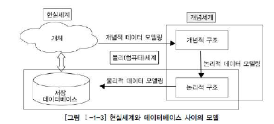

# 데이터 모델링의 이해

## 1. 모델링의 이해

#### 모델링의 특징

- 3대 특징: 추상화, 단순화, 명확화

  1. 추상화(모형화)

     현실세계를 **일정한 형식**에 맞추어 표현

     즉, 다양한 현상을 일정한 양식인 **표기법**에 의해 표현

  2. 단순화

     복잡한 현실 세계를 약속된 규약에 의해 제한된 표기법이나 언어로 표현해 쉽게 이해할 수 있도록 함

  3. 명확화

     누구나 이해하기 쉽도록 대상에 대한 애매모호함을 제거하고 정확하게 현상 기술

- **모델링**: *현실세계를 추상화, 단순화, 명확화하기 위해 일정한 표기법에 의해 표현하는 기법*

- 정보시스템 구축에서는 모델링을 계획/분석/설계 할 때 이용하고 이후 구축/운영 단계에서는 변경과 관리 목적으로 이용한다.

#### 모델링의 세 가지 관점

- **데이터 관점**
  - 업무가 어떤 데이터와 관련 있는지/데이터 간의 관계는 무엇인지에 대해 모델링
  - `What`, `Data`
  - 데이터 모델링이 가장 중요한 부분
- 프로세스 관점
  - 업무가 실제로 하고 있는 일은 무엇인지/무엇을 해야하는지를 모델링
  - `How`, `Process`
- 데이터와 프로세스의 상관관점(데이터 관점 + 프로세스 관점)
  - 업무가 처리하는 일의 방법에 따라 데이터는 어떻게 영향을 받고 있는지 모델링하는 방법

## 2. 데이터 모델의 기본 개념의 이해

#### 모델링의 정의 

- 정보시스템을 구축하기 위해 구축 대상이 되는 업무 내용인 데이터를 정확하게 분석
- 현실세계의 데이터에 대해 약속된 표기법으로 표현하는 과정
- DB를 구축하기 위한 분석/설계 과정

#### 데이터 모델이 제공하는 기능 

- 시스템을 현재 또는 원하는 모습으로 가시화
- 시스템의 구조와 행동을 명세화
- 시스템을 구축하는 구조화된 틀 제공
- 시스템 구축 과정에서 결정한 것을 문서화
- 다양한 영역에 집중하기 위해 다른 영역의 세부 사항은 숨기는 다양한 관점 제공
- 특정 목표에 따라 구체화된 상세 수준의 표현방법 제공

## 3. 데이터 모델링의 중요성 및 유의점

#### 중요성

- 파급효과(Leverage)

  시스템 구축을 위해서는 여러 개의 단위 테스트 -> 성공한다면 -> 병행 테스트 -> 통합 테스트 수행

  만약 데이터 모델링 없이 테스트를 진행했다가, 데이터 구조를 변경해야 한다면 데이터 구축을 다시 한 후 테스트를 다시 수행해야 함 

  이러한 손해를 막기 위해 **데이터 모델링**은 필수적임

- 복잡한 정보 요구사항의 간결한 표현(Conciseness)

  데이터 모델: 구축할 시스템의 **정보 요구사항과 한계를 명확하고 간결하게 표현**할 수 있는 도구

  데이터 모델은 건축물의 설계 도면에 해당

- 데이터 품질(Data Quality)

  데이터 품질을 결정하는 요소는 데이터 구조

  

#### 유의점 

1. 중복(Duplication)

   DB가 여러 장소에 같은 저장을 하지 않도록 막아야 함

2. 비유연성(Inflexibility)

   사소한 변화에도 데이터 모델이 변경되어 유지보수를 어렵게 하지 않도록 해야 함

   **데이터의 정의**를 **데이터의 사용 프로세스**와 분리함으로써 데이터 혹은 프로세스의 작은 변화가 애플리케이션과 DB에 중대한 변화를 일으키지 않도록 함

3. 비일관성(Inconsistency)

   비일관성은 데이터의 중복이 없더라도 발생

   데이터 모델링을 할 때 데이터와 데이터 간 상호 연관 관계에 대해 명확히 정의를 해줘야 비일관성을 막을 수 있음

## 4. 데이터 모델링의 3단계 진행

- 데이터 모델링은 시간에 따라 진행되는 과정으로, 추상화 수준에 따라 `개념적`, `논리적`, `물리적` 데이터 모델로 분류 가능

| 데이터 모델링 | 내용                                                         |
| :-----------: | ------------------------------------------------------------ |
|    개념적     | 추상화 수준 높음 업무중심적 포괄적인 수준의 모델링 진행 전사적 데이터 모델링 EA 수립 시 많이 이용 |
|    논리적     | 시스템으로 구축하고자 하는 업무에 대해 key 속성, 관계 등을 정확하게 표현 재사용성이 높음 |
|    물리적     | 실제 DB에 이식할 수 있도록 성능, 저장 등 물리적 성격을 고려해 설계 |

#### 개념적 데이터 모델링

- 조직, 사용자의 데이터 요구사항을 찾고 분석하는데서 시작

- 주요 활동: 핵심 엔티티와 그들 간의 관계를 발견하고, 이것을 표현하기 위해 엔티티-관계 다이어그램을 생성하는 것

  엔티티-관계 다이어그램은 조직과 다양한 DB 사용자에게 어떤 데이터가 중요한지 나타내기 위해 사용

- 데이터 모델링 과정이 전 조직에 걸쳐 이루어진다면, **전사적 데이터 모델**이라고 부름
- 

#### 논리적 데이터 모델링

#### 물리적 데이터 모델링

## 5, 프로젝트 생명주기(Life Cycle)에서 데이터 모델링

