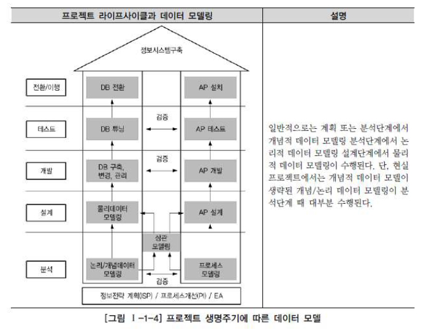

# 데이터 모델링의 이해

## 5. 프로젝트 생명주기에서 데이터 모델링

- Waterfall 기반에서는 데이터 모델링의 위치가 분석과 설계 단계로 구분되어 명확하게 정의 가능

  구조적 방법론에서는 분석단계에서 업무 중심의 **논리적 데이터 모델링**을 수행하고,

  설계 단계에서 하드웨어와 성능을 고려한 **물리적 데이터 모델링**을 수행하게 됨

  

- 데이터 축과 애플리케이션 축으로 구분되어 프로젝트가 진행

  각각에 도출된 사항은 상호 검증을 지속적으로 수행해 단계별 완성도를 높인다

- 객체지향 개념은 데이터와 프로세스를 한꺼번에 바라보면서 모델링을 전개

  -> 데이터 모델링과 프로세스 모델링을 구분하지 않고 일체형으로 진행