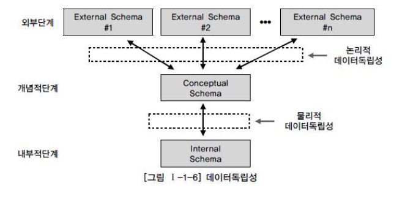

# 데이터 모델링의 이해

## 6. 데이터 모델링에서 데이터 독립성의 이해

#### 1. 데이터독립성의 필요성

- 데이터 독립성의 장점
  1. 지속적으로 증가하는 유지보수 비용을 절감
  2. 데이터 복잡도를 낮춤
  3. 중복된 데이터를 줄임
  4. 사용자 요구사항에 대해 화면과 DB 간에 독립성을 유지하기 위한 목적으로 데이터 독립성 개념 출현

- 데이터 독립성 확보 시 얻는 효과
  1. 각 View의 독립성을 유지하고, 계층별 View에 영향을 주지 않고 변경 가능
  2. 단계별 Schema에 따라 데이터 정의어(DDL)과 데이터 조작어(DML)가 다름을 제공

- 데이터 독립성 이해를 위해 `DB의 3단계 구조`, `독립성`, `사상(Mapping)`을 이해해야 함

#### 2. 데이터베이스 3단계 구조

- 외부 단계

  사용자와 가까운 단계

  사용자 개개인이 보는 자료에 대한 관점이 있는 부분

  사용자가 처리하고자 하는 데이터의 유형, 관점, 방법에 따라 다른 스키마 구조를 가지고 있음

- 개념 단계

  사용자와 물리적인 DB 사이의 단계

  DB 전체의 정보를 표현하는 단계

- 내부 단계

  실제로 DB가 저장되는 저장 장치에 대한 물리적 형태를 표현하는 단계

  하나의 내부 스키마를 갖게 되는 단계

 

#### 3. 데이터 독립성 요소

- 스키마의 개념

  DB 전체적인 논리적 설계를 의미

  데이터 객체, 스키마들의 성질, 스키마들 간의 관계, 데이터 관계들이 갖는 제약 조건에 관한 정의를 총칭하는 개념

  시간에 따라 불변의 특성을 가짐

  데이터의 구조적 특성을 의미하며 인스턴스에 의해 규정됨

- 외부 스키마

  각각의 사용자 그룹이 원하는 형태의 논리적 구조를 정의

  조직 전체가 아니라 일부분을 정의

  외부 스키마는 각각의 사용자 그룹을 위해서 만들어져야 하므로 여러 개가 존재

  응용 프로그래머나 사용자들이 가장 관심을 두는 부분

  - 사용자 관점: 접근하는 특성에 따른 스키마 구성
  - 스키마 기술 사항
    1. 응용 프로그래머나 사용자와 관련된 개체
    2. 응용 프로그래머나 사용자와 관련된 개체들의 관계 및 제약 조건

- 개념 스키마

  모든 응용 시스템과 사용자들이 필요로 하는 데이터를 통합한 조직 전체의 DB 구조를 논리적으로 정의하는 개념으로 하나만 존재

  범 기관적 입장에서 DB 전체를 정의한 것

  - 통합 관점
  - 스키마 기술 사항
    1. 한 기관 전체에서 필요로 하는 모든 개체
    2. 모든 개체의 관계
    3. 유지해야 할 제약 사항
    4. DB 접근 권한, 보안, 무결성 규칙

- 내부 스키마

  전체 DB의 물리적 저장 형태를 기술하는 개념

  개념 스키마의 물리적 저장 형태를 정의하는 개념으로 하나만 존재

  - 물리적 저장 구조
  - 스키마 기술 사항
    1. 저장될 내부 레코드의 형식
    2. 인덱스의 유무
    3. 저장 데이터 항목의 표현 방법
    4. 내부 레코드의 물리적 순서

#### 4. 두 영역의 데이터 독립성

- 논리적 독립성

  개념 스키마가 변경되어도 외부 스키마에는 영향을 미치지 않는 것

  논리적 구조가 변경되어도 응용 프로그램에 영향 없음

  사용자 특성에 맞는 변경 가능

  통합 구조 변경 가능

- 물리적 독립성

  내부 스키마가 변경되어도 외부/개념 스키마는 영향을 받지 않도록 지원

  물리적 저장 장치를 바꾸어야 하는 경우 물리적 구조의 변경이 필요함. 이런 경우에 DB를 사용하는 모든 응용 프로그램의 변경 없이 물리적 데이터 구조 변경 가능

#### 5. 사상(Mapping)

상호 독립적인 개념을 연결시켜주는 다리

데이터 독립성 보장을 위해서는, DBA가 DDL을 필요할 때마다 변경해 주어야 함

각 단계(외부, 개념적, 내부적)의 독립성 보장을 위해 변경 사항 발생 시 DBA가 적절하게 작업해 주어야 독립성이 보장됨

- 외부적/개념적 사상(논리적 사상)

  외부적 뷰와 개념적 뷰의 상호 관련성을 정의

  - 예) 사용자가 접근하는 형식에 따라 다른 타입의 필드를 가질 수 있음. 개념적 뷰의 필드 타입은 변화X

  즉, 논리적 사상은 외부 화면이나 사용자에게 인터페이스하기 위한 스키마 구조 전체가 통합된 개념적 스키마와 연결된다는 의미

- 개념적/내부적 사상(물리적 사상)

  개념적 뷰와 저장된 DB의 상호관련성 정의

  - 예) 만약 저장된 DB 구조가 바뀐다면 개념적/내부적 사상이 바뀌어야 함. 그래야 개념적 스키마가 그대로 남아있게 됨

  즉, 물리적 사상은 통합된 개념적 스키마 구조와 물리적으로 저장된 구조의 물리적인 DB와 연결되는 구조를 의미

  