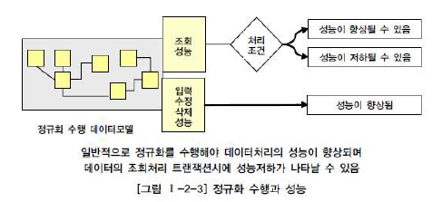

# 데이터 모델링의 성능

## 2. 정규화의 성능

#### 1. 정규화를 통한 성능 향상 전략

정규화: 데이터에 대한 중복성을 제거해주고 데이터를 관심사별로 처리

- 정규화를 수행하면 항상 조회 성능이 저하되어 나타날까?

  DB 처리에서의 성능은 2가지로 나뉨

  1. 조회 성능	2. 입력/수정/삭제 성능

  모델 구성 방식에 따라 두 성능이 trade-off 되어 나타나는 경우가 많음

- 정규화 수행: 함수적 종속을 갖는 일반속성을 의존자로 해 입력/수정/삭제 이상을 제거하는 것

  [그림 1-2-3]을 보면 정규화를 수행한 모델이 반정규화된 테이블에 비해  `입력/수정/삭제 성능`이 향상

   

- 일반적으로 정규화가 잘 되어 있으면 입력/삭제/수정의 성능이 향상되고 반정규화를 많이 하면 조회의 성능이 향상된다고 인식되곤 함

  -> **그러나 반정규화만이 조회 성능을 향상시킨다는 고정관념은 탈피되어야 함**

