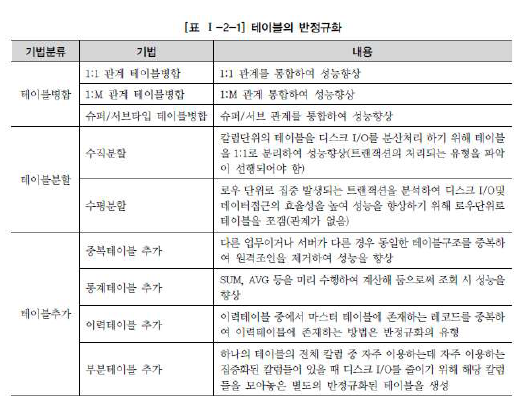
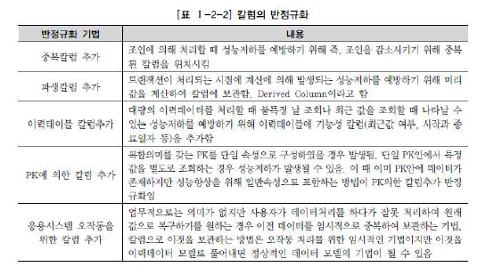
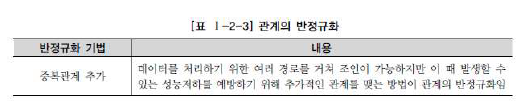

# 데이터 모델링의 성능

## 3. 반정규화의 성능

#### 1. 반정규화를 통한 성능향상 전략

- 반정규화의 정의

  정규화된 엔티티, 속성, 관계에 대해 시스템의 성능향상과 개발과 운영의 단순화를 위해 중복, 통합, 분리 등을 수행하는 데이터 모델링 기법

  **반(half)의 의미가 아닌 한자로 반대하다라는 의미**

  반정규화 != 비정규화 (비정규화는 아예 정규화를 수행하지 않은 모델 의미)

  협의의 반정규화: 데이터를 중복하여 성능을 향상시키기 위한 기법

  - 데이터 무결성이 깨질 수 있는 위험을 무릅쓰고 데이터를 중복해 반정규화를 적용하는 이유
    1. 데이터 조회 시 디스크 I/O 량이 많아서 성능이 저하
    2. 경로가 너무 멀어 조인으로 인한 성능 저하가 예상되는 경우
    3. 칼럼을 계산해 읽을 때 성능이 저하될 것이 예상되는 경우

  - 반정규화를 기술적으로 수행하지 않은 경우
    1. 성능이 저하된 데이터베이스가 생성
    2. 구축단계나 시험단계에서 반정규화를 적용할 때 수정에 따른 노력비용이 많이 들어감

- 반정규화의 적용 방법

  반정규화에 대한 필요성이 결정되면 칼럼의 반정규화 / 테이블의 반정규화 / 관계의 반정규화를 종합적으로 고려해 적용해야 함

  **무결성**을 보장할 수 있는 방법으로 반정규화를 적용해야 함

  - 정규화와 반정규화: `Trade-off 관계` - 정규화만 강조하면 성능 이슈가 발생하고 반정규화를 과도하게 적용하면 데이터 무결성이 깨질 수 있는 위험 증가

  - 반정규화 절차

    1. 반정규화의 대상 조사

       전체 대이터 양을 조사하고 데이터가 해당 프로세스를 처리할 때 성능 저하가 발생하는지 검증

       데이터가 대량이고 성능 저하가 예상된다면 아래 4가지 경우를 고려

       1) 자주 사용되는 테이블에 접근하는 프로세스의 수가 많고 항상 일정한 범위만을 조회하는지

       2) 테이블에 대량 데이터가 있고 대량의 데이터 범위를 자주 처리하는 경우

       3) 통계성 프로세스에 의해 통계 정보를 필요로 할 때 별도의 반정규화 테이블을 생성

       4) 테이블에 지나치게 많은 조인이 걸려있는 경우

    2. 반정규화 대상에 대해 다른 방법으로 처리 가능한지 검토

       가급적이면 무결성을 깨뜨리지 않기 위해 다른 방법 모색

       1) View 사용: 지나치게 많은 조인이 걸려있는 경우 뷰를 통해 해결 가능

       2) 클러스터링 적용 or 인덱스 조정: 대량의 데이터처리나 부분추리에 의해 성능이 저하되는 경우 두 방법으로 성능 향상 가능

       - 클러스터링 적용: 대량의 데이터를 특정 클러스터링 팩트에 의해 저장방식을 다르게 하는 방법

         이 방법은 데이터 입력/수정/삭제 시 성능이 많이 저하되므로 **조회 중심**의 테이블에서만 생성해야 함

       3) 응용 애플리케이션에서 로직을 구사하는 방법을 변경

     3. 반정규화 적용

        세 가지 규칙을 고려해 적용

        반정규화 대상: 테이블, 속성, 관계 (중복만이 반정규화X, 추가 및 제거 가능)

#### 2. 반정규화의 기법

1. 테이블 반정규화

    

2. 칼럼 반정규화

    

3. 관계 반정규화

    

