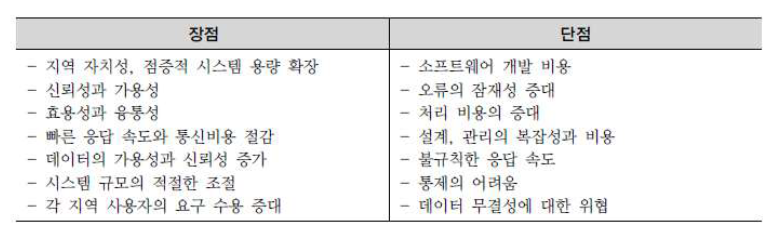
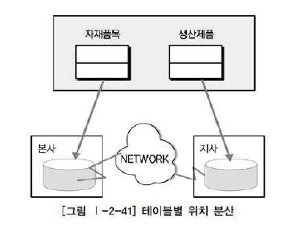
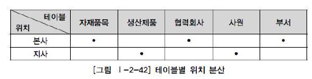

# 데이터 모델링의 성능

## 6. 분산 데이터베이스와 성능

#### 1. 분산 데이터베이스의 개요

##### 1 . 정의

- 여러 곳으로 분산되어있는 DB를 하나의 가상 시스템으로 사용할 수 있도록 한 DB
- 논리적으로는 동일한 시스템에 속하지만, 컴퓨터 네트워크를 통해 물리적으로 분산되어 있는 데이터들의 모임

#### 2. 분산 데이터베이스의 투명성

1. 분할 투명성(단편화)

   하나의 논리적 릴레이션이 여러 단편으로 분할되어 각 단편의 사본이 여러 사이트에 저장

2. 위치 투명성

   사용하려는 데이터의 저장 장소를 명시할 필요 없음. 위치 정보가 시스템 카탈로그에 유지되어야 함

3. 지역사상 투명성

   지역 DBMS와 물리적 DB 사이의 Mapping을 보장해주어야 함

4. 중복 투명성

   DB 객체가 여러 사이트에 중복 되어 있는지 알 필요가 없음

5. 장애 투명성

   구성요소(DBMS, computer)의 장애에 무관한 트랜젝션의 원자성 유지

   > 원자성: 트랜잭션 연산은  DB에 모두 반영되든지 아니면 전혀 반영되지 않아야 함
   >
   > ​              시스템이 가지고 있는 고정요소는 트랜잭션 수행 전과 수행 완료 후의 상태가 같아야 함

6. 병행 투명성

   여러 트랜잭션을 동시에 수행할 때 결과의 일관성을 유지, Time Stamp, 분산 2단계 Locking을 이용해 구현

#### 3. 분산 데이터베이스의 적용 방법 및 장단점

##### 1. 분산 데이터베이스의 적용방법

- 업무의 흐름을 보고 업무 구성에 따른 아키텍쳐의 특징에 따라 DB를 구성하는 것

  단순히 분산 환경에서 DB를 구축하는 것이 목적이 아니라, 업무의 특징에 따라 DB 분산 구조를 선택적으로 설계하는 능력이 필요

  

#### 5. DB 분산구성의 가치

- 통합된 DB에서 제공할 수 없는 빠른 성능 제공

#### 6. 분산 DB의 적용 기법

- DB 분산 종류: 테이블 위치 분산 | 테이블 분할 분산 | 테이블 복제 분산 | 테이블 요약 분산

  가장 많이 사용하는 방식: 테이블 복제 분할 분산 - 성능이 저하되는 많은 DB에서 가장 유용하게 적용할 수 있는 기술적 방법

##### 1. 테이블 위치 분산

- 테이블의 구조가 변하지 않고, 테이블이 다른 DB에 중복되어 생성되지도 않음

  설계된 테이블의 위치를 각각 다르게 위치시키는 것

- 아래 그림은 지역별로 분산되어 생성되는 경우임. 이 경우에는 각각 테이블마다 위치를 표기해야 함

   

   

##### 2. 테이블 분할 분산

- 단순히 위치만 다른 곳에 두는 것이 아니라 테이블을 쪼개어 분산하는 방법

  - 수평분할: 테이블의 row 단위로 분리

    지사에 따라 테이블을 특정 칼럼 값을 기준으로 row 분리

    모든 데이터가 각 지사별로 분리되어 있는 형태를 가지고 있음

    각 지사에 있는 데이터는 다른 지사의 데이터와 항상 배타적으로 존재하며 한 군데 집합시켜도 PK에 의해 중복이 발생하지 않음

    수평분할은 통합처리 프로세스가 많은지(JOIN)를 먼저 검토한 후에 수행해야 함

  - 수직분할: 테이블의 column 단위로 분리