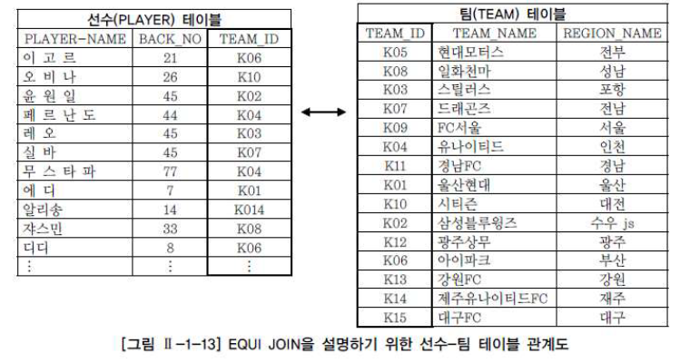
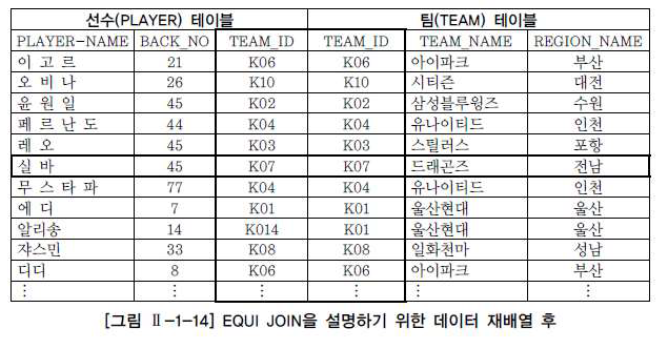
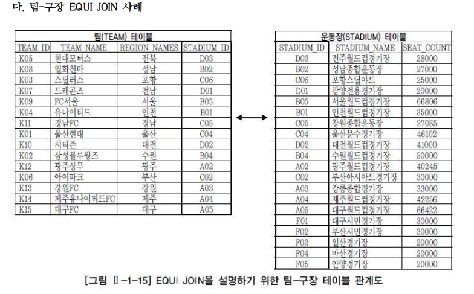
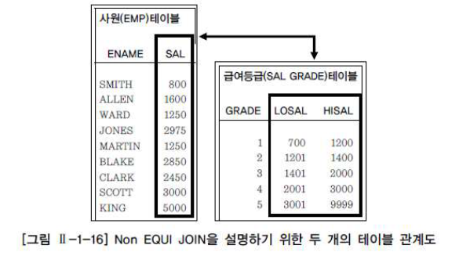

# SQL 기본

## 9. 조인(JOIN)

#### 1. 조인(JOIN) 개요

- 두 개 이상의 테이블들을 연결 또는 결합해 데이터를 출력

- 관계형 DB의 가장 큰 장점이면서 대표적인 핵심 기능

- 일반적인 경우 행들은 PRIMARY KEY(PK)나 FK 값의 연관에 의해 JOIN 성립

  하지만, 어떤 경우에는 PK나 FK가 없어도 논리적인 값들의 연관만으로 JOIN 성립 가능

- 선수 테이블과 팀 테이블이 있는 경우, 선수 테이블을 기준으로 필요한 데이터를 검색하고 이 데이터와 연관된 팀 테이블의 특정 행을 찾아오는 과정이 JOIN을 이용해 데이터를 검색하는 과정으로 볼 수 있음

- 주의할 점 - FROM 절에 여러 테이블이 나열되더라도 SQL에서 데이터를 처리할 때는 단 두 개의 집합 간에만 조인이 일어남

  FROM 절에 A,B,C 테이블이 나열되었더라도 특정 2개의 테이블만 먼저 조인처리되고, 2개의 테이블이 조인되어 처리된 새로운 데이터 집합과 남은 한 개의 테이블이 다음 차례로 조인처리

- 테이블의 조인 순서는 옵티마이저에 의해 결정되고 주요 튜닝 포인트가 됨


#### 2. EQUI JOIN(등가 조인)

- EQUI JOIN은 두 개의 테이블 간에 칼럼 값들이 서로 정확하게 일치하는 경우에 사용되는 방법

  대부분 PK ↔ FK 관계를 기반으로 함

  그러나 일반적으로 테이블 설계 시에 나타난 PK ↔ FK 관계를 이용하는 것이지, 반드시 PK ↔ FK 관계로만 EQUI JOIN이 성립하는 것은 아님

- 계층형이나 망형 데이터베이스와 비교할 때 관계형 데이터베이스의 장점

- JOIN 조건은 WHERE 절에 `=` 연산자를 사용해 기술

  ```SQL
  SELECT 테이블1.칼럼명, 테이블2.칼럼명
  FROM 테이블1, 테이블2
  WHERE 테이블1.칼럼명1 = 테이블2.칼럼명2;
  ```

  <ANSI/ISO SQL 표준 방식>

  ```SQL
  SELECT 테이블1.칼럼명, 테이블2.칼럼명
  FROM 테이블1 INNER JOIN 테이블2
       ON 테이블1.칼럼명1 = 테이블2.칼럼명2;
  ```

- 예제 - 선수 테이블과 팀 테이블에서 선수 이름과 소속된 팀의 이름을 출력

  ```SQL
  SELECT PLAYER.PLAYER_NAME 선수명, TEAM.TEAM_NAME 소속팀명
  FROM PLAYER, TEAM
  WHERE PLAYER.TEAM_ID = TEAM.TEAM_ID;
  ```

  <INNER JOIN>

  ```SQL
  SELECT PLAYER.PLAYER_NAME 선수명, TEAM.TEAM_NAME 소속팀명
  FROM PLAYER INNER JOIN TEAM
       ON PLAYER.TEAM_ID = TEAM.TEAM_ID;
  ```

- `테이블명.칼럼명` 규칙 이유
  1. 다른 테이블에 같은 칼럼명이 있는 경우 어떤 칼럼명을 사용해야 할지 몰라 발생하는 에러 방지
  2. SQL에 대한 가독성과 유지보수성을 높이는 효과

- INNER JOIN에 참여하는 대상 테이블을 N개라고 하면, N개의 테이블로부터 필요한 데이터를 조회하기 위해 필요한 JOIN 조건은 대상 테이블 개수에서 하나를 뺀 N-1개 이상이 필요
- JOIN 조건은 WHERE절에 기술하며 JOIN은 2개 이상의 테이블에서 필요한 데이터를 출력하기 위한 가장 기본적이 조건

- 가. 선수-팀 EQUI JOIN 사례 - 선수 테이블과 팀 테이블에서 선수들의 이름, 백넘버, 팀명, 연고지를 알고 싶다는 요구사항 확인

  

  1. 선수 테이블과 팀 테이블 간의 관계 파악

     선수 테이블의 팀코드와 팀 테이블의 팀 코드가 PK ↔ FK 관계를 맺고 있음 

  2. 선수 테이블의 소속팀 코드를 기준으로 팀 테이블에 들어있는 데이터의 순서를 바꿔주면 아래와 같이 변경됨

      

     위의 데이터(그림 2-1-14)를 출력하기 위한 SELECT SQL 문장을 작성

     ```SQL
     SELECT PLAYER.PLAYER_NAME, PLAYER.BACK_NO, PLAYER.TEAM_ID, TEAM.TEAM_NAME, TEAM.REGION_NAME
     FROM PLAYER, TEAM
     WHERE PLAYER.TEAM_ID = TEAM.TEAM_ID;
     ```

     <INNER JOIN>

     ```SQL
     SELECT PLAYER.PLAYER_NAME, PLAYER.BACK_NO, PLAYER.TEAM_ID, TEAM.TEAM_NAME, TEAM.REGION_NAME
     FROM PLAYER INNER JOIN TEAM 
          ON PLAYER.TEAM_ID = TEAM.TEAM_ID;
     ```

     위 예제를 확인하면 PLAYER와 TEAM이 칼럼 앞에 반복해서 나옴

     긴 테이블명을 되풀이하는 것은 개발 생산성을 떨어뜨리므로 SELECT 절에서 칼럼에 대한 ALIAS를 사용한는 것처럼 FROM 절의 테이블에서도 ALIAS 사용 가능

     - 예제 - 칼럼과 테이블에 ALIAS를 사용해 위 SQL을 수정

       ```SQL
       SELECT P.PLAYER_NAME 선수명, P.BACK_NO 백넘버, P.TEAM_ID 팀코드, T.TEAM_NAME 팀명, T.REGION_NAME 연고지
       FROM PLAYER P, TEAM T
       WHERE P.TEAM_ID = T.TEAM_ID;
       ```

       <INNER JOIN>

       ```SQL
       SELECT P.PLAYER_NAME 선수명, P.BACK_NO 백넘버, P.TEAM_ID 팀코드, T.TEAM_NAME 팀명, T.REGION_NAME 연고지
       FROM PLAYER P INNER JOIN TEAM T
            ON P.TEAM_ID = T.TEAM_ID;
       ```

- 나. 선수 - 팀 WHERE 절 검색 조건 사례

  WHERE절에서 JOIN 조건 이외의 검색 조건에 대한 제한 조건을 덧붙여 사용할 수 있음

  즉, EQUI JOIN의 최소한의 연관 관계를 위해서 테이블 개수 -1개의 JOIN 조건을 WHERE절에 명시하고 부수적인 제한조건을 논리 연산자를 통해 추가로 입력하는 것이 가능

  - 예제 - 가 사례에서 WHERE 절에 포지션이 골키퍼인 선수들에 대한 데이터만을 백넘버 순으로 출력

    ```SQL
    SELECT P.PLAYER_NAME 선수명, P.BACK_NO 백넘버, T.REGION_NAME 연고지, T.TEAM_NAME 팀명 
    FROM PLAYER P, TEAM T
    WHERE P.TEAM_ID = T.TEAM_ID AND P.POSITION = 'GK'
    ORDER BY P.BACK_NO;
    ```

    <INNER JOIN>

    ```SQL
    SELECT P.PLAYER_NAME 선수명, P.BACK_NO 백넘버, T.REGION_NAME 연고지, T.TEAM_NAME 팀명 
    FROM PLAYER P INNER JOIN TEAM T
         ON P.TEAM_ID = T.TEAM_ID 
    WHERE P.POSITION = 'GK'
    ORDER BY P.BACK_NO;
    ```

    JOIN 조건 기술 시 **주의사항**

    만약 테이블에 대한 ALIAS를 적용해서 SQL 문장을 작성했을 경우, WHERE 절과 SELECT 절에는 테이블 명이 아닌 테이블에 대한 ALIAS를 사용해야 함

    하지만, 하나의 SQL 문장 내에서 유일하게 사용하는 칼럼명이라면 칼럼명 앞에 ALIAS를 붙이지 않아도 됨

  - 예제 - 위 SQL 문장에서 FROM 절에서 테이블에 대한 ALIAS를 정의했는데,

    SELECT 절이나 WHERE 절에서 테이블명을 사용한다면 DBMS의 옵티마이저가 칼럼명이 부적합하다는 에러를 파싱 단계에서 발생시킴

    ```SQL
    SELECT PLAYER.PLAYER_NAME 선수명, P.BACK_NO 백넘버, T.REGION_NAME 연고지, T.TEAM_NAME 팀명 // ERROR: 열명 부적합
    FROM PLAYER P, TEAM T
    WHERE P.TEAM_ID = T.TEAM_ID AND P.POSITION = 'GK'
    ORDER BY P.BACK_NO;
    ```

- 다. 팀-구장 EQUI JOIN 사례

   
  - 예제 - [그림 2-1-15]에 나와있는 팀 테이블과 구장 테이블의 관계를 이용해 소속팀이 가지고 있는 전용 구장의 정보를 팀 정보와 함께 출력

    ```SQL
    SELECT TEAM.REGION_NAME, TEAM.TEAM_NAME, TEAM.STADIUM_ID, STADIUM.STADIUM_NAME, STADIUM.SEAT_COUNT
    FROM TEAM, STADIUM
    WHERE TEAM.STADIUM_ID = STADIUM.STADIUM_ID;
    ```

    <INNER JOIN>

    ```SQL
    SELECT TEAM.REGION_NAME, TEAM.TEAM_NAME, TEAM.STADIUM_ID, STADIUM.STADIUM_NAME, STADIUM.SEAT_COUNT
    FROM TEAM INNER JOIN STADIUM
         ON TEAM.STADIUM_ID = STADIUM.STADIUM_ID;
    ```

    <ALIAS + `=` 조인>

    ```SQL
    SELECT T.REGION_NAME, T.TEAM_NAME, T.STADIUM_ID, S.STADIUM_NAME, S.SEAT_COUNT
    FROM TEAM T, STADIUM S
    WHERE T.STADIUM_ID = S.STADIUM_ID;
    ```

    <ALIAS + INNER JOIN>

    ```SQL
    SELECT T.REGION_NAME, T.TEAM_NAME, T.STADIUM_ID, S.STADIUM_NAME, S.SEAT_COUNT
    FROM TEAM T INNER JOIN STADIUM S
         ON T.STADIUM_ID = S.STADIUM_ID;
    ```

    중복이 되지 않는 칼럼의 경우 ALIAS를 사용하지 않아도 되므로 ALIAS를 사용한 예제와 사용하지 않은 예제는 같은 결과를 냄

    그러나, 같은 이름을 가진 중복 칼럼의 경우는 테이블명이나 ALIAS가 필수 조건

    

#### 3. Non EQUI JOIN(비등가 조인)

- 비등가 조인은 두 개의 테이블 간에 칼럼 값들이 서로 정확하게 일치하지 않는 경우에 사용
- `=`  연산자가 아닌 다른 연산자(`BETWEEN`, `>`, `>=`, `<`, `<=` 등)를 사용해 JOIN 수행
- 데이터 모델에 따라서 비등가 조인이 불가능한 경우도 있음

- 비등가 조인의 형태

  ```SQL
  SELECT 테이블1.칼럼명, 테이블2.칼럼명
  FROM 테이블1, 테이블2
  WHERE 테이블1.칼럶명1 BETWEEN 테이블2.칼럼명1 AND 테이블2.칼럼명2; 
  ```

- 예제 - 사원이 받고 있는 급여가 어느 등급인지 출력

  ```SQL
  SELECT E.ENAME, E.JOB, E.SAL, S.GRADE
  FROM EMP E, SALGRADE S
  WHERE E.SAL BETWEEN S.LOSAL AND S.HISAL;
  ```

   

  급여등급 테이블에는 1~5까지 등급이 존재

  사원 테이블에서 사원들의 급여를 등급으로 표시하고 싶을 때 `=` 연산자로 조인 불가능

  사원 테이블 데이터를 기준으로 급여 등급 테이블의 어느 등급에 속하는지 알기 위해 `BETWEEN  ` 사용


#### 4. 3개 이상의 TABLE JOIN

- 예제 - PLAYER + TEAM + STADIUM

  ```SQL
  SELECT P.PLAYER_NAME 선수명, P.POSITION 포지션, T.REGION_NAME 연고지, T.TEAM_NAME 팀명, S.STADIUM_NAME 구장명
  FROM PLAYER P, TEAM T, STADIUM S
  WHERE P.TEAM_ID = T.TEAM_ID AND T.STADIUM_ID = S.STADIUM_ID;
  ```

  <INNER JOIN>

  ```SQL
  SELECT P.PLAYER_NAME 선수명, P.POSITION 포지션, T.REGION_NAME 연고지, T.TEAM_NAME 팀명, S.STADIUM_NAME 구장명
  FROM PLAYER P INNER JOIN TEAM T
       ON P.TEAM_ID = T.TEAM_ID
       INNER JOIN STADIUM S
       ON T.STADIUM_ID = S.STADIUM_ID 
  ORDER BY 선수명;
  ```

  