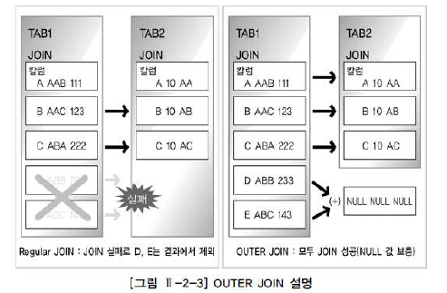
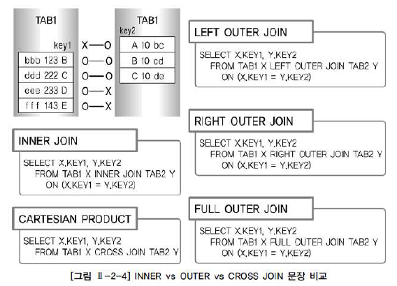

# SQL 활용

## 1. 표준 조인

#### 1. STANDARD SQL 개요

- 가. 일반 집합 연산자

   

  1. UNION

     SQL - UNION 기능

     수학적 합집합을 제공하고 공통 교집합의 중복을 없애기 위한 사전 작업으로 시스템의 부하를 줄여주는 정렬 작업이 발생

     이후 `UNION ALL` 기능 추가 - 특별한 요구 사항이 없다면 공통집합을 중복해서 그대로 보여주기 때문에 정렬 작업이 일어나지 않는 장점

     만약 `UNION`과 `UNION ALL`의 출력 결과가 같다면, 응답 속도 향상이나 자원 효율화 측면에서 데이터 정렬 작업이  발생하지 않는 `UNION ALL`을 사용하는 것을 권고

  2. INTERSECTION

     SQL - INTERSECTION 기능

     수학의 교집합으로 두 집합의 공통 집합 추출

  3. DIFFERENCE

     SQL - EXCEPT(ORACLE - MINUS) 기능

     수학적 차집합

     첫 번째 집합 - 두 번째 집합

     대다수 벤더는 `EXCEPT`를 ORACLE은 `MINUS`용어 사용 (SQL 표준에는 `EXCEPT`로 표시되어 있으며, 벤더에서 SQL 표준 기능을 구현할 때 다른 용어를 사용하는 것은 현실적으로 허용되고 있음)

   4. PRODUCT

      SQL - CROSS JOIN 기능

      CROSS PRODUCT라고 불리는 곱집합

      JOIN 조건이 없는 경우 생길 수 있는 모든 데이터의 조합

      양쪽 집합의 `M*N` 건의 데이터 조합이 발생

      CASTESIAN PRODUCT라고도 표현

- 나. 순수 관계 연산자

   

  순수 관계 연산자는 관계형 DB를 구현하기 위해 새로 만들어진 연산자

  5. SELECT 연산

     SQL - WHERE 절로 구현

  6. PROJECT 연산

     SQL - SELECT 절로 구현

  7. (NATURAL) JOIN

     SQL - 다양한 JOIN 기능으로 구현

     INNER JOIN, NATURAL JOIN, OUTER JOIN, USING 조건절, ON 조건절 등

  8. DIVDE

     SQL - 현재 사용되지 않음

     그림에서 왼쪽 집합을 'XZ'로 나눴을 때, 'XZ'를 모두 가지고 있는 'A'가 답이 되는 기능

- 관계형 DB의 경우 요구사항 분석, 개념적 데이터 모델링, 논리적 데이터 모델링, 물리적 데이터 모델링 단계를 거치게 되는데, 이 단계에서 엔티티 확정 및 정규화 과정, 그리고 M:N 관계를 분해하는 절차를 거치게 됨

  특히 정규화 과정의 경우 데이터 정합성과 데이터 저장 공간의 절약을 위해 엔티티를 최대한 분리하는 과정으로, 일반적으로 3차 정규형이나 BCNF 까지 진행하게 됨

  이런 정규화를 거치면 하나의 주제에 관련 있는 엔티티가 여러 개로 나누어지게 되고, 이 엔티티들이 주로 테이블이 되는데 이렇게 흩어진 데이터를 연결해 원하는 데이터로 가져오는 작업이 바로 JOIN

  관계형 DB에 있어 JOIN은 SQL의 가장 중요한 기능


#### 2. FROM절 JOIN 형태

- ANSI/ISO SQL에서 표시하는 FROM절의 JOIN 형태

  ```
  - INNER JOIN - NATURAL JOIN - USING 조건절 - ON 조건절- CROSS JOIN - OUTER JOIN
  ```

  ANSI/ISO SQL에서 규정한 JOIN 문법은 WHERE절을 사용하던 기존 JOIN 방식과 차이가 있음

  사용자는 기존 WHERE 절의 검색 조건과 테이블 간의 JOIN 조건을 구분 없이 사용하던 방식을 그대로 사용할 수 있으면서, 추가된 선택 기능으로 테이블 간의 JOIN 조건을 FROM절에서 명시적으로 정의할 수 있게 됨

  `INNER JOIN`: WHERE절에서부터 사용하던 JOIN의 DEFAULT 옵션

  ​                        JOIN 조건에서 동일한 값이 있는 행만 반환

  ​						DEFAULT 옵션이므로 생략 가능 BUT `CROSS JOIN` `OUTER JOIN`과 같이 사용 불가

  `NATURAL JOIN`: `INNER JOIN`의 하위 개념

  ​							두 테이블 간 동일한 이름을 갖는 모든 칼럼에 대해 EQUI(=) JOIN 수행

  ​							`NATURAL INNER JOIN`이라고 표시 가능

  `ON 조건절`: 새로운 SQL JOIN 문장 중에서 **가장 중요하게 기억해야 하는 문장**

  ​					`NATURAL JOIN`처럼 JOIN 조건이 숨어 있지 않고, 명시적으로 JOIN 조건 구분 가능

  ​					`NATURAL JOIN`이나 `USING` 조건절처럼 칼럼명이 똑같아야 된다는 제약 없이 칼럼명이 달라도

  ​					JOIN 조건으로 사용 가능

  ​					다만, FROM 절에 테이블이 많이 사용될 경우 다소 복잡해보여 가독성이 떨어지는 단점

  ​					이런 측면에서 SQL SERVER가 `ON 조건절`만 지원하고 `NATURAL JOIN` `USING`조건절을

  ​					지원하지 않는 것으로 보임


#### 3. INNER JOIN

- `OUTER JOIN`과 대비해 내부 JOIN이라고 하며 JOIN 조건에서 동일한 값이 있는 행만 반환

- `INNER JOIN 표시`: WHERE 절에서 사용하던 JOIN 조건을 FROM 절에서 정의하겠다는 표시이므로 `USING 조건절`이나 `ON 조건절`을 필수적으로 사용해야 함

- 예제 - 사원 번호, 사원 이름, 소속부서 코드, 소속부서 이름 출력

  <WHERE절 JOIN 조건>

  ```SQL
  SELECT EMP.DEPTNO, EMPNO, ENAME, DNAME
  FROM EMP, DEPT
  WHERE EMP.DEPTNO = DEPT.DEPTNO;
  ```

  < FROM절 JOIN 조건>

  ```SQL
  SELECT EMP.DEPTNO, EMPNO, ENAME, DNAME
  FROM EMP INNER JOIN DEPT
  ON EMP.DEPTNO = DEPT.DEPTNO;
  ```

  < INNER JOIN은 DEFAULT로 아래와 같이 생략 가능>

  ```SQL
  SELECT EMP.DEPTNO, EMPNO, ENAME, DNAME
  FROM EMP JOIN DEPT
  ON EMP.DEPTNO= DEPT.DEPTNO;
  ```


#### 4. NATURAL JOIN

- 두 테이블 간의 동일한 이름을 갖는 모든 칼럼들에 대해 `EQUI JOIN`을 수행

  `NATURAL JOIN`이 명시되면 추가로 `USING 조건절`, `ON 조건절`, `WHERE 절`에서 JOIN 조건을 정의할 수 없음

- 예제 - 사원번호, 사원 이름, 소속부서 코드, 소속부서 이름 출력

  ```SQL
  SELECT DEPTNO, EMPNO, ENAME, DNAME
  FROM EMP NATURAL JOIN DEPT;
  ```

  위 SQL은 별도의 JOIN 칼럼을 지정하지 않았지만 두 개의 테이블에서 `DPETNO`라는 공통된 칼럼을 자동으로 인식해 JOIN을 처리

  JOIN에 사용된 칼럼들은 같은 데이터 유형이어야 하며, ALIAS나 테이블 명과 같은 접두사를 붙일 수 없음

  ```SQL
  SELECT EMP.DEPTNO, EMPNO, ENMAE, DNAME
  FROM EMP NATURAL JOIN DPET; // ERROR: NATURAL JOIN에 사용된 열은 식별자를 가질 수 없음
  ```

- 예제 - `*` 와일드 카드처럼 별도의 칼럼 순서를 지정하지 않으면 NATURAL JOIN의 기준이 되는 칼럼들이 다른 칼럼보다 먼저 출력 (DEPTNO가 첫 번째 칼럼)

  이 때, JOIN에 사용된 같은 이름의 칼럼을 하나로 처리

  ```SQL
  SELECT * FROM EMP NATURAL JOIN DEPT;
  ```

  ```
  DEPTNO EMPNO ENAME JOB MGR HIREDATE SAL COMM DNAME LOC 
  ----- ----- ------------- --- -------- ---- ---- --------- ------ 
  20 7369 SMITH CLERK 7902 1980-12-17 800 RESEARCH DALLAS 
  30 7499 ALLEN SALESMAN 7698 1981-02-20 1600 300 SALES CHICAGO 
  30 7521 WARD SALESMAN 7698 1981-02-22 1250 500 SALES CHICAGO 
  20 7566 JONES MANAGER 7839 1981-04-02 2975 RESEARCH DALLAS 
  30 7654 MARTIN SALESMAN 7698 1981-09-28 1250 1400 SALES CHICAGO 
  30 7698 BLAKE MANAGER 7839 1981-05-01 2850 SALES CHICAGO 
  10 7782 CLARK MANAGER 7839 1981-06-09 2450 ACCOUNTING NEW YORK 
  20 7788 SCOTT ANALYST 7566 1987-07-13 3000 RESEARCH DALLAS 
  10 7839 KING PRESIDENT 1981-11-17 5000 ACCOUNTING NEW YORK 
  30 7844 TURNER SALESMAN 7698 1981-09-08 1500 SALES CHICAGO 
  20 7876 ADAMS CLERK 7788 1987-07-13 1100 RESEARCH DALLAS 
  30 7900 JAMES CLERK 7698 1981-12-03 950 0 SALES CHICAGO 
  20 7902 FORD ANALYST 7566 1981-12-03 3000 RESEARCH DALLAS 
  10 7934 MILLER CLERK 7782 1982-01-23 1300 ACCOUNTING NEW YORK
  ```

- 예제 - 반면 `INNER JOIN`의 경우 첫 번째 테이블, 두 번째 테이블의 칼럼 순서대로 데이터가 출력됨

  이때 `NATURAL JOIN`은 JOIN에 사용된 같은 이름의 칼럼을 하나로 처리하지만,

  **INNER JOIN은 별개의 칼럼으로 표시 **

  ```SQL
  SELECT *
  FROM EMP INNER JOIN DEPT
  ON EMP.DEPTNO = DEPT.DEPTNO;
  ```

  ```
  EMPNO ENAME JOB MGR HIREDATE SAL COMM DEPTNO DEPTNO DNAME LOC 
  ---- ----- ------ --- ------- --- ---- ----- ----- -------- ----- 
  7369 SMITH CLERK 7902 1980-12-17 800 20 20 RESEARCH DALLAS 
  7499 ALLEN SALESMAN 7698 1981-02-20 1600 300 30 30 SALES CHICAGO 
  7521 WARD SALESMAN 7698 1981-02-22 1250 500 30 30 SALES CHICAGO 
  7566 JONES MANAGER 7839 1981-04-02 2975 20 20 RESEARCH DALLAS 
  7654 MARTIN SALESMAN 7698 1981-09-28 1250 1400 30 30 SALES CHICAGO 
  7698 BLAKE MANAGER 7839 1981-05-01 2850 30 30 SALES CHICAGO 
  7782 CLARK MANAGER 7839 1981-06-09 2450 10 10 ACCOUNTING NEW YORK 
  7788 SCOTT ANALYST 7566 1987-07-13 3000 20 20 RESEARCH DALLAS 
  7839 KING PRESIDENT 1981-11-17 5000 10 10 ACCOUNTING NEW YORK 
  7844 TURNER SALESMAN 7698 1981-09-08 1500 0 30 30 SALES CHICAGO 
  7876 ADAMS CLERK 7788 1987-07-13 1100 20 20 RESEARCH DALLAS 
  7900 JAMES CLERK 7698 1981-12-03 950 30 30 SALES CHICAGO 
  7902 FORD ANALYST 7566 1981-12-03 3000 20 20 RESEARCH DALLAS 
  7934 MILLER CLERK 7782 1982-01-23 1300 10 10 ACCOUNTING NEW YORK
  ```

- 예제 - `NATURAL JOIN`과 `INNER JOIN`의 차이를 자세히 설명하기 위해 DEPT_TEMP 테이블을 임시로 만듦

  ```SQL
  [ORACLE] CREATE TABLE DEPT_TEMP AS SELECT * FROM DEPT;
  [SQL] SELECT * INTO DEPT_TEMP FROM DEPT;
  
  UPDATE DEPT_TEMP SET DNAME = 'R&D' WHERE DNAME='RESEAERCH';
  UPDATE DEPT_TEMP SET DNAME ='MARKETING' WHERE DNAME = 'SALES';
SELECT * FROM DEPT_TEMP;
  ```
  
  ```
  DEPTNO DNAME LOC 
  -------- ---------- --------- 
  10 ACCOUNTING NEW YORK 
  20 R&D DALLAS 
  30 MARKETING CHICAGO 
  40 OPERATIONS BOSTON
  ```
  
  부서번호 20과 30의 DNAME이 'R&D'와 'MARKETING'으로 변경된 것을 확인 가능

- 예제 - 세 개의 칼럼명이 모두 같은 DEPT와 DEPT_TEMP 테이블을 NATURAL(INNER) JOIN으로 수행

  ```SQL
  SELECT * FROM DEPT NATURAL INNER JOIN DEPT_TEMP;
  [동일] SELECT * FROM NATURAL JOIN DEPT_TEMP;
  ```

  ```
  DEPTNO DNAME LOC ------ ---------- ---------- 
  10 ACCOUNTING NEW YORK 
  40 OPERATIONS BOSTON
  ```

  DNAME의 내용이 바뀐 부서번호 20, 30의 데이터는 실행 결과에서 제외

- 예제 - 같은 조건이지만 출력 칼럼에서 차이가 나는 일반적인 INNER JOIN 수행

  ```SQL
  SELECT * FROM DEPT JOIN DEPT_TEMP
  	ON DEPT.DEPTNO = DEPT_TEMP.DEPTNO
  	AND DEPT.DNAME = DEPT_TEMP.DNAME
  	AND DEPT.LOC = DEPT_TEMP.LOC;
  	
  [동일]
  SELECT * FROM DEPT, DEPT_TEMP
  WHERE DEPT.DEPTNO  = DEPT_TEMP.DEPTNO
  AND DEPT.DNAME = DEPT_TEMP.DNAME
  AND DEPT.LOC = DEPT_TEMP.LOC;
  ```

  ```
  DEPTNO DNAME LOC DEPTNO DNAME LOC 
  ------ ---------- -------- ------ ---------- ------ 
  10 ACCOUNTING NEW YORK 10 ACCOUNTING NEW YORK 
  40 OPERATIONS BOSTON 40 OPERATIONS BOSTON
  ```

  DNAME이 변경된 부서번호 20, 30은 결과에서 제외됨

  차이가 나는 부분은 **NATURAL JOIN은 JOIN에 사용된 같은 이름을 하나로 처리하지만, INNER JOIN은 2개의 칼럼으로 표시**


#### 5. USING 조건절

- NATURAL JOIN에서는 모든 일치하는 칼럼들에 대해 JOIN이 이루어지지만, FROM절의 USING 조건절을 이용하면 같은 이름을 가진 칼럼들 중 원하는 칼럼에 대해서만 선택적으로 EQUI JOIN을 할 수 있음
- SQL SERVER는 지원X

- 예제 - 세 개의 칼럼명이 모두 같은 DEPT와 DEPT_TEMP 테이블을 DEPTNO 칼럼을 이용한 (INNER) JOIN의 USING 조건절로 수행

  ```SQL
  SELECT * FROM DEPT
  JOIN DEPT_TEMP
  USING (DEPTNO);
  ```

  ```
  DEPTNO DNAME LOC DNAME LOC 
  ------ ---------- --------- ---------- --------- 
  10 ACCOUNTING NEW YORK ACCOUNTING NEW YORK 
  20 RESEARCH DALLAS R&D DALLAS 
  30 SALES CHICAGO MARKETING CHICAGO 
  40 OPERATIONS BOSTON OPERATIONS BOSTON
  ```

  위의 와일드카드처럼 별도의 칼럼 순서를 지정하지 않으면 **USING 조건절의 기준이 되는 칼럼이 다른 칼럼보다 먼저 출력됨**

  USING JOIN은 JOIN에 사용된 같은 이름의 칼럼을 하나로 처리

- 예제 - USING 조건절을 이용한 EQUI JOIN에서도 NATURAL JOIN과 마찬가지로 JOIN 칼럼에 대해서는 ALIAS나 테이블 이름과 같은 접두사를 붙일 수 없음 

  <잘못된 사례>

  ```SQL
  SELECT DEPT.DEPTNO, DEPT.DNAME, DEPT.LOC, DEPT_TEMP.DNAME, DEPT_TEMP.LOC
  FROM DEPT
  JOIN DEPT_TEMP
  USING (DEPTNO); //USING 절의 열 부분은 식별자를 갖질 수 없음
  ```

  <바른 사례>

  ```SQL
  SELECT DEPTNO, DEPT.DNAME, DEPT.LOC, DEPT_TEMP.DNAME, DEPT_TEMP.LOC
  FROM DEPT
  JOIN DEPT_TEMP
  USING (DEPTNO);
  ```

  ```
  DEPTNO DNAME LOC DNAME LOC 
  ------- --------- --------- ----------- -------- 
  10 ACCOUNTING NEW YORK ACCOUNTING NEW YORK 
  20 RESEARCH DALLAS R&D DALLAS 
  30 SALES CHICAGO MARKETING CHICAGO 
  40 OPERATIONS BOSTON OPERATIONS BOSTON
  ```

- 예제 - DEPT와 DEPT_TEMP 테이블의 일부 데이터 내용이 변경되었던 DNAME 칼럼을 조인 조건으로 (INNER) JOIN의 USING 조건절을 수행

  ```SQL
  SELECT * FROM DEPT
  JOIN DEPT_TEMP
  USING (DNAME);
  ```

  ```
  DNAME DEPTNO LOC DEPTNO LOC 
  ---------- ------ --------- ------- ---------
  ACCOUNTING 10 NEW YORK 10 NEW YORK 
  OPERATIONS 40 BOSTON 40 BOSTON
  ```

  위 SQL의 경우 DNAME의 바뀐 부서번호 20, 30의 경우는 결과에서 제외된 것을 확인 가능

  그리고 USING에 사용된 DNAME이 첫 번째 칼럼으로 출력된 것과 함께,

  JOIN 조건에 참여하지 않은 DEPTNOㅇ와 LOC이 2개의 칼럼으로 표시된 것을 확인 가능

- 예제 - 세 개의 칼럼명이 모두 같은 DEPT와 DEPT_TEMP 테이블을 LOC와 DEPTNO 2개 칼럼을 이용한 (INNER) JOIN의 USING 조건절로 수행

  ```SQL
  SELECT * FROM DEPT
  JOIN DEPT_TEMP
  USING (LOC, DEPTNO);
  ```

  ```
  LOC DEPTNO DNAME DNAME 
  -------- ------ ---------- ---------- 
  NEW YORK 10 ACCOUNTING ACCOUNTING 
  DALLAS 20 RESEARCH R&D 
  CHICAGO 30 SALES MARKETING 
  BOSTON 40 OPERATIONS OPERATIONS
  ```

  USING에 사용된 LOC, DEPTNO가 1, 2번째 칼럼으로 출력되고, JOIN 조건에 참여하지 않은 DNAME 칼럼은 2개의 칼럼으로 표시

- 예제 - DEPTNO, DNAME 2개의 칼럼을 이용한 (INNER) JOIN의 USING 조건절로 수행

  ```SQL
  SELECT * FROM DEPT
  JOIN DEPT_TEMP
  USING (DEPTNO, DNAME);
  ```

  ```SQL
  DEPTNO DNAME LOC LOC 
  ------ ---------- -------- -------- 
  10 ACCOUNTING NEWYORK NEW YORK 
  40 OPERATIONS BOSTON BOSTON
  ```

  DNAME의 내용이 바뀐 부서번호 20, 30의 경우는 결과에서 제외

  USING에 사용된 DEPTNO, DNAME이 1,2번째  칼럼으로 출력

  JOIN 조건에 참여하지 않은 LOC가 2개의 칼럼으로 표시


#### 6. ON 조건절

- `JOIN 서술부(ON 조건절)`와 `비 JOIN 서술부(WHERE 조건절)`를 분리하여 이해가 쉬우며, 칼럼명이 다르더라도 JOIN 조건을 사용할 수 있는 장점이 있음 

- 예제 - 사원 테이블과 부서 테이블에서 사원 번호와 사원 이름, 소속부서 코드, 소속부서 이름을 출력

  ```SQL
  SELECT E.EMPNO, E.ENAME, E.DEPTNO, D.DNAME
  FROM EMP E
  JOIN DEPT D
  ON (E.DEPTNO = D.DEPTNO);
  ```

  ```
  EMPNO ENAME DEPTNO DNAME 
  ----- ------- ------ ----------- 
  7369 SMITH 20 RESEARCH 
  7499 ALLEN 30 SALES 
  7521 WARD 30 SALES 
  7566 JONES 20 RESEARCH 
  7654 MARTIN 30 SALES 
  7698 BLAKE 30 SALES 
  7782 CLARK 10 ACCOUNTING 
  7788 SCOTT 20 RESEARCH 
  7839 KING 10 ACCOUNTING 
  7844 TURNER 30 SALES 
  7876 ADAMS 20 RESEARCH 
  7900 JAMES 30 SALES
  7902 FORD 20 RESEARCH 
  7934 MILLER 10 ACCOUNTING
  ```

  NATURAL JOIN의 JOIN 조건은 기본적으로 같은 이름을 가진 모든 칼럼들에 대한 동등 조건이지만,

  임의의 JOIN 조건을 지정하거나, 이름이 다른 칼럼명을 JOIN 조건으로 사용하거나, JOIN 칼럼을 명시하기 위해서는 ON 조건절을 사용

  ON 조건에서 **괄호는 옵션 사항**

  USING 조건절을 이용한 JOIN에서는 JOIN 칼럼에 대해서 ALIAS나 테이블 명과 같은 접두사를 사용하면 에러가 나지만,

  반대로 ON 조건절을 사용한 JOIN의 경우는 **ALIAS나 테이블명과 같은 접두사를 사용하여 SELECT에 사용되는 칼럼을 논리적으로 명확하게 지정해주어야 함**

  (E.DEPTNO = D.DEPTNO) ON 조건절은 WHERE 절의 JOIN 조건과 같은 기능을 하면서도,

  **명시적으로 JOIN의 조건을 구분할 수 있으므로 가장 많이 사용될 것으로 예상됨**

  다만, FROM절에 테이블이 많이 사용될 경우 다소 복잡하게 보여 가독성이 떨어지는 단점이 있음

- 가. WHERE 절과의 혼용

  - 예제 - ON 조건절과 WHERE 검새개 조건은 충돌 없이 사용 가능

    부서코드 30인 부서의 소속 사원 이름 및 소속 부서 코드, 부서 코드, 부서 이름 검색

    ```SQL
    SELECT E.ENAME, E.DEPTNO, D.DEPTNO, D.DNAME
    FROM EMP E
    JOIN DEPT D
    ON (E.DEPTNO = D.DEPTNO)
    WHERE E.DEPTNO = 30;
    ```

    ```
    ENAME DEPTNO DEPTNO DNAME 
    ------- ------ ------ ------ 
    ALLEN 30 30 SALES
    WARD 30 30 SALES 
    MARTIN 30 30 SALES 
    BLAKE 30 30 SALES 
    TURNER 30 30 SALES 
    JAMES 30 30 SALES
    ```

- 나. ON 조건절 + 데이터 검증 조건 추가

  ON 조건절에 JOIN 조건 외에도 데이터 검색 조건을 추가할 수는 있으나,

  검색 조건 목적인 경우는 WHERE 절을 사용할 것을 권고

  (다만 OUTER JOIN에서 조인의 대상을 제한하기 위한 목적으로 사용되는 추가 조건의 경우는 ON 절에 표기되어야 함)

  - 예제 - 매니저 사원번호가 7698번인 사원들의 이름 소속 부서 코드, 부서 이름을 찾아본다

    ```SQL
    SELECT E.ENAME, E.MGR, D.DEPTNO, D.DNAME
    FROM EMP E
    JOIN DEPT D
    ON (E.DEPTNO = D.DEPTNO AND E.MGR = 7698);
    ```

    ```SQL
    SELECT E.ENAME, E.MGR, D.DEPTNO, D.DNAME
    FROM EMP E
    JOIN DEPT D
    ON (E.DEPTNO = D.DEPTNO)
    WHERE E.MGR = 7698;
    ```

    두 SQL은 같은 결과를 출력

    ```
    ENAME MGR DEPTNO DNAME 
    ------- ---- ------ ------ 
    ALLEN 7698 30 SALES 
    WARD 7698 30 SALES 
    MARTIN 7698 30 SALES
    TURNER 7698 30 SALES 
    JAMES 7698 30 SALES
    ```

- 다. ON 조건절 예제

  - 예제 - 팀과 스타디움 테이블을 스타디움 ID로 JOIN하여 팀이름, 스타디움 ID, 스타디움 이름을 찾아본다.

    ```SQL
    SELECT TEAM_NAME, TEAM.STADUIM_ID, STADIUM_NAME
    FROM TEAM
    JOIN STADIUM
    ON TEAM.STADIUM_ID = STADIUM.STADIUM_ID
    ORDER BY STADIUM_ID;
    ```

    <STADIUM_ID라는 공통 칼럼을 가지고 USING 조건절로 구현>

    ```mysql
    SELECT TEAM_NAME, STADIUM_ID, STADIUM_NAME
    FROM TEAM
    JOIN STADIUM
    USING (STADIUM_ID)
    ORDER BY STADIUM_ID;
    ```

    <고전 방식인 WHERE 절의 INNER JOIN으로 구현>

    ```SQL
    SELECT TEAM_NAME, TEAM.STADIUM_ID, STADIUM_NAME
    FROM TEAM, STADIUM
    WHERE TEAM.STADIUM_ID = STADIUM.STADIUM_ID
    ORDER BY STADIUM_ID;
    ```

    ```
    TEAM_NAME STADIUM_ID STADIUM_NAME 
    ------------- --------- ------------- 
    광주상무 A02 광주월드컵경기장 
    강원FC A03 강릉종합경기장 
    제주유나이티드FC A04 제주월드컵경기장 
    대구FC A05 대구월드컵경기장 
    유나이티드 B01 인천월드컵경기장 
    일화천마 B02 성남종합운동장 
    삼성블루윙즈 B04 수원월드컵경기장 
    FC서울 B05 서울월드컵경기장 
    아이파크 C02 부산아시아드경기장 
    울산현대 C04 울산문수경기장 
    경남FC C05 창원종합운동장 
    스틸러스 C06 포항스틸야드 
    드래곤즈 D01 광양전용경기장 
    시티즌 D02 대전월드컵경기장
    ```

  - 예제 - 팀과 스타디움 테이블을 팀 ID로 JOIN하여 팀이름, 팀ID, 스타디움 이름을 찾아본다.

    STADIUM에는 팀ID가 HOMETEAM_ID라는 칼럼으로 표시되어 있음

    ```SQL
    SELECT TEAM_NAME, TEAM_ID, STADIUM_NAME
    FROM TEAM
    JOIN STADIUM
    ON TEAM.TEAM_ID = STADIUM.HOMETEAM_ID
    ORDER BY TEAM ID;
    ```

    <WHERE절의 INNER JOIN으로도 구현 가능>

    ```SQL
    SELECT TEAM_NAME, TEAM_ID, STADIUM_NAME
    FROM TEAM, STADIUM
    WHERE TEAM.TEAM_ID = STADIUM.HOMETEAM_ID
    ORDER BY TEAM_ID;
    ```

    TEAM_ID와 HOMETEAM_ID라는 다른 이름의 칼럼을 사용하는 경우 USING 조건절 사용 불가

- 라. 다중 테이블 JOIN

  - 예제 - 사원과 DEPT 테이블의 소속 부서명, DEPT_TEMP 테이블의 바뀐 부서명 정보를 출력

    ```SQL
    SELECT E.EMPNO, D.DEPTNO, D.DNAME, T.DNAME New _DNAME
    FROM EMP E
    JOIN DEPT D
    ON (E.DEPTNO = T.DEPTNO)
    JOIN DEPT_TEMP
    ON (E.DEPTNO = T.DEPTNO);
    ```

    <WHERE 절의 INNER JOIN으로 구현 가능>

    ```SQL
    SELECT E.EMPNO, D.DEPTNO, D.DNAME, T.DNAME New _DNAME
    FROM EMP E, DEPT D, DEPT_TEMP T
    WHERE E.DEPTNO = D.DEPTNO
    AND E.DEPTNO = T.DEPTNO;
    ```

    ```
    EMPNO DEPTNO DNAME NEW_DNAME 
    ------ ------ --------- ----------- 
    7369 20 RESEARCH R&D 
    7499 30 SALES MARKETING 
    7521 30 SALES MARKETING 
    7566 20 RESEARCH R&D
    7654 30 SALES MARKETING 
    7698 30 SALES MARKETING 
    7782 10 ACCOUNTING ACCOUNTING 
    7788 20 RESEARCH R&D 
    7839 10 ACCOUNTING ACCOUNTING 
    7844 30 SALES MARKETING 
    7876 20 RESEARCH R&D 
    7900 30 SALES MARKETING 
    7902 20 RESEARCH R&D 
    7934 10 ACCOUNTING ACCOUNTING
    ```

  - 예제 - GK 포지션의 선수별 연고지명, 팀명, 구장명 출력

    ```SQL
    SELECT P.PLAYER_NAME 선수명, P.POSITION 포지션, T.REGION_NAME 연고지명, T.TEAM_NAME 팀명, S.STADIUM_NAME 구장명
    FROM PLAYER P
    JOIN TEAM T
    ON P.TEAM_ID = T.TEAM_ID
    JOIN STADIUM S
    ON T.STADIUM_ID = S.STADIUM_ID
    WHERE P.POSITION = 'GK'
    ORDER BY 선수명;
    ```

    <WHERE 절의 INNER JOIN으로 구현>

    ```SQL
    SELECT P.PLAYER_NAME 선수명, P.POSITION 포지션, T.REGION_NAME 연고지명, T.TEAM_NAME 팀명, S.STADIUM_NAME 구장명
    FROM PLAYER P,TEAM T, STADIUM S
    WHERE P.TEAM_ID = T.TEAM_ID
    AND T.STADIUM_ID = S.STADIUM_ID
    AND P.POSITION = 'GK'
    ORDER BY 선수명;
    ```

  - 예제 - 홈팀이 3점 차이로 승리한 경기의 경기장 이름, 경기 일정, 홈팀 이름, 원정팀 이름 정보 출력

    ```SQL
    SELECT ST.STADIUM_NAME, SC.SCHE_DATE, HT.TEAM_NAME, AT.TEAM_NAME, HOME_SCORE, AWAY_SCORE
    FROM SCHEDULE SC
    JOIN STADIUM ST
    ON SC.STADIUM_ID = ST.STADIUM_ID
    JOIN TEAM HT
    ON SC.HOMETEAM_ID = HT.TEAM_ID
    JOIN TEAM AT
    ON SC.AWAYTEAM_ID = AT.TEAM_ID
    WHERE HOME_SCORE >= AWAY_SCORE +3;
    ```

    <WHERE 절의 INNER JOIN으로 구현>

    ```SQL
    SELECT ST.STADIUM_NAME, SC.SCHE_DATE, HT.TEAM_NAME, AT.TEAM_NAME, HOME_SCORE, AWAY_SCORE
    FROM SCHEDULE SC, STDIUM ST, TEAM HT, TEAM AT
    WHERE HOME_SCORE >= AWAY_SCORE + 3
    AND SC.STADIUM_ID = ST.STADIUM_ID
    AND SC.HOMETEAM_ID = HT.TEAM_I
    AND SC.AWAYTEAM_ID = AT.TEAM_ID;
    ```


#### 7. CROSS JOIN

- E.F.CODD 박사가 언급한 일반 집합 연산자의 PRODUCT의 개념으로 테이블 간 JOIN 조건이 없는 경우 생길 수 있는 모든 데이터 조합을 의미

- 두 개의 테이블에 대한 `CARTESIAN PRODUCT` 또는 `CROSS PRODUCT`와 같은 표현으로,

  결과는 양쪽 집합의 **MxN**건의 데이터 조합이 발생

- 예제 - 사원 이름과 소속부서 이름을 찾아본다

  ```SQL
  SELECT ENAME, DNAME
  FROM EMP
  CROSS JOIN DEPT
  ORDER BY ENAME;
  ```

  ```
  ENAME DNAME 
  -------- --------- 
  ADAMS SALES 
  ADAMS RESEARCH 
  ADAMS OPERATIONS 
  ADAMS ACCOUNTING 
  ALLEN OPERATIONS 
  ALLEN RESEARCH 
  ALLEN ACCOUNTING
  ALLEN SALES 
  BLAKE SALES 
  BLAKE OPERATIONS 
  BLAKE RESEARCH 
  BLAKE ACCOUNTING 
  CLARK SALES 
  CLARK RESEARCH 
  CLARK OPERATIONS 
  CLARK ACCOUNTING
  ```

- 예제 - NATURAL JOIN의 경우 WHERE 절에서 JOIN 조건을 추가할 수 없지만, 

  **CROSS JOIN의 경우 WHERE절에 JOIN 조건을 추가할 수 있다.**

  그러나 이 경우는 **CROSS JOIN이 아니라 INNER JOIN과 같은 결과를 얻기 때문에**

  CROSS JOIN을 사용하는 의미가 없어지므로 권고하지 않음

  ```SQL
  SELECT ENAME, DNAME
  FROM EMP
  CROSS JOIN DEPT
  WHERE EMP.DEPTNO = DEPT.DEPTNO;
  ```

  <위와 동일한 결과 얻음>

  ```SQL
  SELECT ENAME, DNAME
  FROM EMP
  INNER JOIN DEPT
  WHERE EMP.DEPTNO = DEPT.DEPTNO;
  ```

  ```
  ENAME DNAME 
  ------- --------- 
  SMITH RESEARCH 
  ALLEN SALES 
  WARD SALES 
  JONES RESEARCH 
  MARTIN SALES 
  BLAKE SALES 
  CLARK ACCOUNTING 
  SCOTT RESEARCH 
  KING ACCOUNTING
  TURNER SALES
  ADAMS RESEARCH 
  JAMES SALES 
  FORD RESEARCH 
  MILLER ACCOUNTING
  ```

  정상적인 데이터 모델은 CROSS PRODUCT가 필요한 경우가 많지 않음

  간혹 튜닝이나 리포트를 작성하기 위해 고의로 사용할 수 있음

  데이터웨어하우스의 개별 DIMENSION(차원)을 FACT(사실) 칼럼과 JOIN 하기 전에 모든 DIMENSION의 CROSS PROJECT를 먼저 구할 때 유용하게 사용 가능


#### 8. OUTER JOIN

- INNER JOIN과 대비하여 OUTER JOIN이라고 불리며, JOIN 조건에서 **동일한 값이 없는 행도 반환할 때 사용 가능**

  

  [그림2-2-3]은 TAB1 테이블이 TAB2 테이블을 JOIN하되, TAB2의 JOIN 데이터가 있는 경우는 TAB2 데이터를 함께 출력하고, TAB2의 JOIN 데이터가 없는 경우에도 TAB1의 모든 데이터를 표시하고 싶은 경우임

  TAB1의 모든 값에 대해 TAB2의 데이터가 반드시 존재한다는 보장이 없는 경우 OUTER JOIN을 사용해 해결 가능

  과거 OUTER JOIN을 위해 ORACLE은 JOIN 칼럼 뒤에 `(+)`를 표시,

  SYSBASE는 비교 연산자의 앞이나 뒤에 `(+)`를 표시했었는데,

  - JOIN 조건과 WHERE 절 검색 조건이 불명확한 단점

  - IN이나 OR 연산자 사용시 에러 발생
  - `(+)` 표시가 누락된 칼럼 존재시 OUTER JOIN 오류 발생
  - FULL OUTER JON 미지원

  과 같은 불편함이 많았음

  `STANDARD JOIN`을 사용함으로써 `OUTER JOIN`의 많은 문제점을 해결할 수 있었고,

  대부분의 관계형 DBMS 간에 호환성을 확보할 수 있으므로 명시적인 `OUTER JOIN`을 사용할 것을 적극적으로 권장

  추가로 OTUER JOIN 역시 JOIN 조건을 FROM 저레서 정의하겠다는 표시이므로

  **USING 조건절이나 ON 조건절을 필수적으로 사용해야 함**

  LEFT/RIGHT OUTER JOIN의 경우 기준이 되는 테이블이 조인 수행시 무조건 `드라이빙 테이블`이 됨

- 가. LEFT OUTER JOIN

  - 조인 수행시 먼저 표기된 좌측 테이블에 해당하는 데이터를 먼저 읽은 후,

    나중에 표기된 우측 테이블에서 JOIN 대상 데이터를 읽어옴

    TABLE A와 B가 있을 때(A가 기준), A와 B를 비교해서 B의 JOIN 칼럼에서 같은 값이 있을 때 그 해당 데이터를 가져오고, B의 JOIN 칼럼에서 같은 값이 없는 경우 B 테이블에서 가져오는 칼럼들은 NULL 값으로 채움

  - LEFT JOIN으로 OUTER 키워드 생략 가능

  - 예제 - STADIUM에 등록된 운동장 중에는 홈팀 없는 경기장도 있음. STADIUM과 TEAM을 JOIN하되 홈팀이 없는 경기장의 정보도 같이 출력

    ```SQL
    SELECT STADIUM_NAME, STADIUM.STADIUM_ID, SEAT_COUNT, HOMETEAM_ID, TEAM_NAME
    FROM STADIUM
    LEFT OUTER JOIN TEAM
    ON STADIUM.HOMETEAM_ID = TEAM.TEAM_ID
    ORDER BY HOMETEAM_ID;
    ```

    ```
    STADIUM_NAME STADIUM_ID SEAT_COUNT HOMETEAM_ID TEAM_NAME 
    ------------ --------- ---------- ----------- ---------- 
    울산문수경기장 C04 46102 K01 울산현대 
    수원월드컵경기장 B04 50000 K02 삼성블루윙즈 
    포항스틸야드 C06 25000 K03 스틸러스 
    인천월드컵경기장 B01 35000 K04 유나이티드 
    전주월드컵경기장 D03 28000 K05 현대모터스 
    부산아시아드경기장 C02 30000 K06 아이파크 
    광양전용경기장 D01 20009 K07 드래곤즈 
    성남종합운동장 B02 27000 K08 일화천마 
    서울월드컵경기장 B05 66806 K09 FC서울 
    대전월드컵경기장 D02 41000 K10 시티즌 
    창원종합운동장 C05 27085 K11 경남FC 
    광주월드컵경기장 A02 40245 K12 광주상무 
    강릉종합경기장 A03 33000 K13 강원FC 
    제주월드컵경기장 A04 42256 K14 제주유나이티드FC 
    대구월드컵경기장 A05 66422 K15 대구FC 
    안양경기장 F05 20000 
    마산경기장 F04 20000 
    일산경기장 F03 20000 
    부산시민경기장 F02 30000 
    대구시민경기장 F01 30000
    ```

    INNER JOIN이라면 홈팀이 배정된 15개의 경기장만 출력되었겠지만, LEFT OUTER JOIN을 사용했기 때문에 홈팀 없는 아래 5개의 정보가 추가로 출력됨

- 나. RIGHT OUTER JOIN

  - 조인 수행시 LEFT JOIN과 반대로 우측 테이블이 기준이 되어 결과 생성

  - RIGHT JOIN으로 OUTER 키워드 생략해서 사용 가능

  - 예제 - DEPT에 등록된 부서 중에는 사원이 없는 부서도 있다. DEPT와 EMP를 조인하되 사원이 없는 부서 정보도 같이 출력하도록 한다

    ```SQL
    SELECT E.ENAME, D.DEPTNO, D.DNAME
    FROM EMP E
    RIGHT OUTER JOIN DEPT D
    ON E.DEPTNO = D.DEPTNO;
    ```

    ```
    ENAME DEPTNO DNAME LOC 
    ----- ------ ---------- -------- 
    CLARK 10 ACCOUNTING NEW YORK 
    KING 10 ACCOUNTING NEW YORK 
    MILLER 10 ACCOUNTING NEW YORK 
    JONES 20 RESEARCH DALLAS 
    FORD 20 RESEARCH DALLAS 
    ADAMS 20 RESEARCH DALLAS 
    SMITH 20 RESEARCH DALLAS 
    SCOTT 20 RESEARCH DALLAS 
    WARD 30 SALES CHICAGO 
    TURNER 30 SALES CHICAGO 
    ALLEN 30 SALES CHICAGO 
    JAMES 30 SALES CHICAGO 
    BLAKE 30 SALES CHICAGO 
    MARTIN 30 SALES CHICAGO 
           40 OPERATIONS BOSTON
    ```

    RIGHT OUTER JOIN을 사용했기 때문에 사원이 배정되지 않은 부서번호 40의 OPERATIONS 부서의 LOC까지 출력됨

- 다. FULL OUTER JOIN

  - 조인 수행시 좌측, 우측 테이블의 모든 데이터를 읽어 JOIN하여 결과를 생성

    즉, TABLE A와 B가 있을 때 (A,B 모두 기준), RIGHT OUTER JOIN과 LEFT OUTER JOIN의 결과를 합집합으로 처리한 결과와 동일

    단, UNION ALL이 아닌 UNION 기능과 같으므로 중복되는 데이터는 삭제

  - FULL JOIN으로 OUTER 키워드 생략 가능

  - 예제 - DEPT 테이블과 DEPT_TEMP 테이블의 FULL OUTER JOIN 사례를 만들기 위해 DEPT_TEMP의 DEPTNO를 수정

    결과적으로 DEPT_TEMP 테이블의 새로운 DEPTNO 데이터는 DEPT 테이블의 DEPTNO와 2건은 동일하고 2건은 새로운 DEPTNO가 생성

    ```SQL
    UPDATE DEPT_TEMP
    SET DEPTNO = DEPTNO + 20;
    
    SELECT * FROM DEPT_TEMP;
    ```

    ```SQL
    DEPTNO DNAME LOC 
    ------ ---------- ---------- 
    30 ACCOUNTING NEW YORK 
    40 R&D DALLAS 
    50 MARKETING CHICAGO 
    60 OPERATIONS BOSTON
    ```

  - 예제 - DEPTNO 기준으로 DEPT와 DEPT_TEMP 데이터를 FULL OUTER JOIN으로 출력

    ```SQL
    SELECT * FROM DEPT
    FULL OUTER JOIN DEPT_TEMP
    ON DEPT.DEPTNO = DEPT_TEMP.DEPTNO;
    ```

    <위와 결과 동일 - LEFT OUTER JOIN + RIGHT OUTER JOIN>

    ```SQL
    SELECT L.DEPTNO, L.DNAME, L.LOC, R.DEPTNO, R.DNAME, R.LOC
    FROM DEPT L
    LEFT OUTER JOIN DEPT_TEMP R
    ON L.DPETNO = R.DEPTNO
    UNION
    SELECT L.DEPTNO, L.DNAME, L.LOC, R.DEPTNO, R.DNAME, R.LOC
    FROM DEPT L
    RIGHT OUTER JOIN DEPT_TEMP R
    ON L.DEPTNO = R.DEPTNO;
    ```

    ```
    DEPTNO DNAME LOC DEPTNO DNAME LOC 
    ------ ---------- -------- ------ ----------- ------ 
    10 ACCOUNTING NEW YORK 
    20 RESEARCH DALLAS 
    30 SALES CHICAGO 
    30 ACCOUNTING NEW YORK 
    40 OPERATIONS BOSTON 
    40 R&D DALLAS 
    50 MARKETING CHICAGO 
    60 OPERATIONS BOSTON
    ```

    INNER JOIN이라면 부서번호가 동일한 30, 40 부서의 정보만 출력되겠지만,

    FULL OUTER JOIN을 사용하였기 때문에 DEPT 테이블에만 있는 부서번호 10,20의 부서와

    DEPT_TEMP 테이블에만 있는 부서번호 50, 60의 부서 정보까지 같이 출력


#### 9. INNER vs OUTER vs CROSS JOIN



