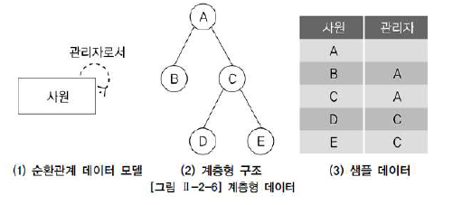

# SQL 활용

## 3. 계층형 질의와 셀프 조인

#### 1. 계층형 질의

- 테이블에 계층형 데이터가 존재하는 경우 데이터를 조회하기 위해 계층형 질의를 사용

- 계층형 데이터: 동일 테이블에 상위와 하위 데이터가 포함된 데이터

  EX) 사원 테이블: 사원 - 관리자 (상위 사원)

  ​       조직 테이블: 상위 조직 - 하위 조직

- 엔터티를 순환관계 데이터 모델로 설계할 경우 데이터 발생

  EX) 조직, 사원, 메뉴 등

  

- 가. ORACLE 계층형 질의

  ```sql
  SELECT ...
  FROM 테이블
  WHERE condition AND condition ...
  START WITH condition
  CONNECT BY [NOCYCLE] condition AND condition ...
  [ORDER SIBLINGS BY cloumn, column, ...]
  ```

  - `START WITH`

    계층 구조 전개의 시작 위치를 지정. 즉, 루트 데이터를 지정한다.

  - `CONNECT BY`

    다음에 전개될 자식 데이터를 지정

    자식  데이터는 CONNECT BY절에 주어진 조건을 만족해야 함(조인)

  - `PRIOR`

    `CONNECT BY` 절에 사용되며, 현재 읽은 칼럼을 지정

    PRIOR 자식 = 부모 형태를 사용하면 계층구조에서 자식 데이터에서 부모 데이터(자식 → 부모) 방향으로 전개하는 순방향 전개

    PRIOR 부모 = 자식 형태를 사용하면 반대로 부모 데이터에서 자식 데이터(부모 → 자식) 방향으로 전개하는 역방향 전개

  - `NOCYCLE`

    데이터를 전개하면서 이미 나타났던 동일한 데이터가 전개 중 다시 나타난다면 이것을 가리켜 **사이클(CYCLE)이 형성되었다**라고 말함

    사이클이 발생한 데이터는 런타임 오류가 발생

    하지만 **NOCYCLE를 추가하면 사이클이 발생한 이후의 데이터는 전개하지 않음**

  - `ORDER SIBLINGS BY `

    형재 노드(동일 LEVEL) 사이에서 정렬 수행

  - `WHERE`

    모든 전개를 수행한 뒤 지정된 조건을 만족하는 데이터만 추출(필터링)

- ORACLE은 계층형 질의를 사용할 때 다음과 같은 가상 칼럼을 제공

  - LEVEL - 루트 데이터이면 1, 하위 데이터이면 2. LEAF 데이터까지 1씩 증가

  - CONNECT_BY_ISLEAF - 전개 과정에서 해당 데이터가 리프 데이터면 1 아니면 0

  - CONNECT_BY_ISCYCLE - 전개 과정에서 자식을 갖는데 해당 데이터가 조상으로서 존재하면 1, 아니면 0

    여기서 조상이란 자신으로부터 루트까지의 경로에 존재하는 데이터를 말함

    **CYCLE 옵션을 사용했을 때만 사용 가능**


#### 2. 셀프 조인

- 셀프 조인이란 동일 테이블 사이의 조인

- FROM 절에 동일 테이블이 2번 이상 나타남

- 동일 테이블 사이의 조인을 수행하면 테이블과 칼럼 이름이 모두 동일하기 때문에 식별을 위해 반드시 테이블 별칭(ALIAS)을 사용해야 한다.

  그리고 칼럼에도 모두 테이블 별칭을 사용해서 어느 테이블의 칼럼인지 식별해줘야 한다.

  ```SQL
  SELECT ALIAS명1.칼럼명, ALIAS2.칼럼명,..
  FROM 테이블1 ALIAS명1, 테이블2 ALIAS명2
  WHERE ALIAS명1.칼럼명 = ALIAS명2.칼럼명;
  
  SELECT WORKER.ID 사원번호, WORKER.NAME 사원명, MANAGER.NAME 관리자명
  FROM EMP WORKER, EMP MANAGER
  WHERE WORKER.MGR = MANAGER.ID;
  ```

  

- 셀프 조인은 동일한 테이블이지만 개념적으로는 2개의 서로 다른 테이블을 사용하는 것과 동일

  동일 테이블을 다른 테이블인 것처럼 처리하기 위해 테이블 별칭을 사용함

  그림 2-2-11 에서는 E1, E1라는 별칭을 사용

  차상위 관리자를 구하기 위해서 E1.관리자 = E2.사원 조인 조건을 사용

  ```SQL
  SELECT E1.사원, E1.관리자, E.관리자 차상위_관리자
  FROM 사원 E1, 사원 E2
  WHERE E1.관리자 = E2.사원
  ORDER BY E1.사원;
  ```

  ```
  사원 관리자 차상위_관리자 
  ---- ------ ---------- 
  B A 
  C A 
  D C A 
  E C A
  ```

  자신의 관리자가 존재하지 않는 경우 관리자 테이블에서 조인할 대상이 존재하지 않기 때문에 해당 데이터는 결과에서 누락

  **이를 방지하기 위해 아우터 조인 사용**

  ```SQL
  SELECT E1.사원, E1.관리자, E2.관리자 차상위_관리자 
  FROM 사원 E1 
  LEFT OUTER JOIN 사원 E2
  ON (E1.관리자 = E2.사원) 
  ORDER BY E1.사원;
  ```

  