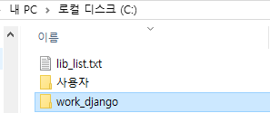
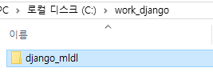
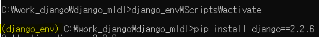
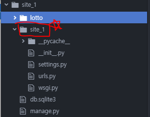

# Django

### 장고 프로젝트 폴더 및 Python 가상환경 생성

---

1. `work_django` 폴더 생성 -> `django_mldl` 폴더 생성

   ```powershell
   mkdir work_django
   mkdir django_mldl
   ```

      

2. 가상환경 생성

   ```shell
   pip install virtualenv==16.7.7
   virtualenv django_env
   Scripts activate
   pip install django==2.2.6
   ```

    

3. site_1폴더 생성

   site_1 폴더 밑에 site_1 폴더가 생김

   ```shell
   django-admin startproject site_1
   ```

    

