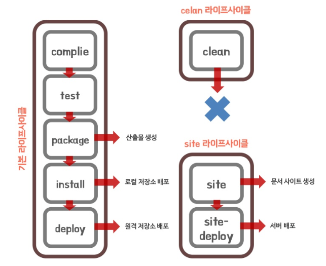

# Maven이란?

> 참고
>
> https://jeong-pro.tistory.com/168
>
> https://mangkyu.tistory.com/8

## Maven

- 자바 프로젝트의 빌드를 자동화 해주는 **빌드 툴**

  자바 소스를 `compile`하고 `package`해서 `deploy`하는 일을 자동화

- 필요한 라이브러리를 특정 문서(pom.xml)에 정의해 놓으면 네트워크를 통해 라이브러리를 자동으로 다운 받아줌

  > requirements.txt 같기도...


##  Maven의 장점

1. 라이브러리 관리를 용이하게 해줌
2. 프로젝트의 작성, 컴파일, 페트스 등 프로젝트 라이프 사이클에 포함되는 각 테스트를 지원해줌
3. war 파일 기반의 배포용으로도 자주 사용됨


## Maven의 LifeCycle

- 메이븐은 프레임워크로 동작 방식이 정해져 있음

  단계가 연계된 goal을 실행하는 과정을 build라 하며, build들의 순서를 LifeCycle이라고 함

  **즉, 미리 정의된 빌드 순서를 LifeCycle이라 하고, 각 빌드 단계를 Phase라고 함**

  - phase는 특정 순서에 따라 goal이 실행되도록 구조를 제공

- 크게 `default`, `clean`, `site` 라이프 사이클로 나눈다.

  - default: 일반적인 빌드 프로세스를 위한 모델
  - clean: 빌드 시 생성되었던 output을 지워줌
  - site: 프로젝트 문서와 사이트 작성을 수행

 

- 간단한 이클립스 run as에서의 기본적인 Maven build lifecycle 
  - `Maven build`: 메이븐 빌드를 실행
  - `Maven build...`: 새로운 사용자 빌드 생성
  - `Maven clean`: target에 지정된 모든 소스를 삭제
  - `Maven generate-sources`: 컴파일 과정에 포함될 소스를 생성
  - `Maven install`: Local Repository에 패키지 복사


## Maven이 참조하는 설정 파일

1. settings.xml

   - maven tool 자체에 관련된 설정을 담당

   - `MAVEN_HOME/conf/`에 위치 

     MAVEN_HOME: 환경변수에 설정한 경로

2. pom.xml

   - `POM(Project Object Model)`을 설정하는 부분

     **프로젝트 내 빌드 옵션을 설정하는 역할**


## pom.xml

> https://github.com/spring-project/spring-petclinic의 pom.xml

1. 프로젝트 정보
   - `<modelVersion>`: maven의 pom.xml 모델 버전 - 형식이 4.0.0 버전이라고 이해
   - `<groupId>`: 프로젝트를 생성한 조직이나 그룹명 - 보통 URL 역순으로 지정
   - `<artifactId>`: 프로젝트에서 생성되는 기본 artifact 고유 이름
   - `<version>`: 애플리케이션의 버전 - `SNAPSHOT`이 붙으면 아직 개발 단계라는 의미< 메이븐에서 라이브러리를 관리하는 방식이 다름
   - `<packaging>`: 여긴 없지만 jar, war, ear, pom 등 패키지 유형을 나타냄
   - `<name>`: 프로젝트 명
   - `<description>`: 여긴 없지만 프로젝트 설명
   - `<properties`>: pom.xml에서 중복해서 사용되는 설정(상수) 값들을 지정해놓는 부분

2.  의존성 라이브러리 정보
   - `<dependencies>`에 의존성 라이브러리 정보를 적을 수 있음
   - 최소한 `groupId`, `artifactId`, `version` 정보가 필요함
   - `스프링 부트의 spring-boot-starter-*`의 경우, 부모 pom.xml에서 이미 버전 정보가 있어 version은 따로 지정할 필요 없음
   - A라는 라이브러리를 사용할 때, B,C,D가 의존성을 가진다면 A를 dependency에 추가시 자동으로 B,C,D 기능을 가져옴
3. build 정보
   - `build`부분에 maven의 핵심인 **빌드 관련 정보를 저장**

```xml
<?xml version="1.0" encoding="UTF-8"?>
<project xmlns:xsi="http://www.w3.org/2001/XMLSchema-instance"
  xmlns="http://maven.apache.org/POM/4.0.0"
  xsi:schemaLocation="http://maven.apache.org/POM/4.0.0 https://maven.apache.org/xsd/maven-4.0.0.xsd">
  <modelVersion>4.0.0</modelVersion>
  <groupId>org.springframework.samples</groupId>
  <artifactId>spring-petclinic</artifactId>
  <version>2.3.1.BUILD-SNAPSHOT</version>

  <parent>
    <groupId>org.springframework.boot</groupId>
    <artifactId>spring-boot-starter-parent</artifactId>
    <version>2.3.1.RELEASE</version>
  </parent>
  <name>petclinic</name>

  <properties>
    <!-- Generic properties -->
    <java.version>1.8</java.version>
    <project.build.sourceEncoding>UTF-8</project.build.sourceEncoding>
    <project.reporting.outputEncoding>UTF-8</project.reporting.outputEncoding>

    <!-- Web dependencies -->
    <webjars-bootstrap.version>3.3.6</webjars-bootstrap.version>
    <webjars-jquery-ui.version>1.11.4</webjars-jquery-ui.version>
    <webjars-jquery.version>2.2.4</webjars-jquery.version>
    <wro4j.version>1.8.0</wro4j.version>

    <jacoco.version>0.8.5</jacoco.version>
    <nohttp-checkstyle.version>0.0.4.RELEASE</nohttp-checkstyle.version>
    <spring-format.version>0.0.22</spring-format.version>
  </properties>

  <dependencies>
    <!-- Spring and Spring Boot dependencies -->
    <dependency>
      <groupId>org.springframework.boot</groupId>
      <artifactId>spring-boot-starter-actuator</artifactId>
    </dependency>
    <dependency>
      <groupId>org.springframework.boot</groupId>
      <artifactId>spring-boot-starter-cache</artifactId>
    </dependency>
    <dependency>
      <groupId>org.springframework.boot</groupId>
      <artifactId>spring-boot-starter-data-jpa</artifactId>
    </dependency>
...이하 생략
  </dependencies>

  <build>
    <plugins>
      <plugin>
        <groupId>io.spring.javaformat</groupId>
        <artifactId>spring-javaformat-maven-plugin</artifactId>
        <version>${spring-format.version}</version>
        <executions>
          <execution>
            <phase>validate</phase>
            <goals>
              <goal>validate</goal>
            </goals>
          </execution>
        </executions>
      </plugin>
...이하 생략
        
          </plugins>
        </pluginManagement>
      </build>
    </profile>
  </profiles>

</project>
```

