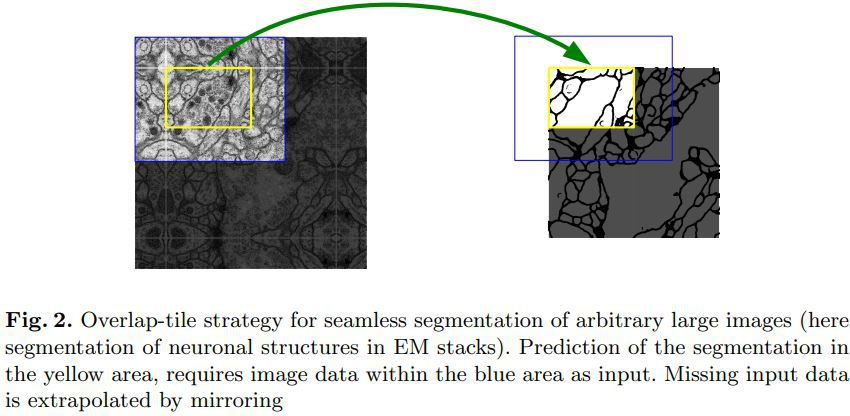

# U-net

> 참고
>
> - https://m.blog.naver.com/PostView.nhn?blogId=worb1605&logNo=221333597235&proxyReferer=https%3A%2F%2Fwww.google.com%2F
> - https://wingnim.tistory.com/47

### 0. 용어 설명

- Patch

  이미지  인식 단위

- Contracting Path, Expanding Path

  이미지를 점점 줄여나가는 빨간 상자 구간이`Contracting Path`, 이미지를 키워나가는 파란 상자 구간이 `Expanding Path`

  

- Context

  이웃한 픽셀들 간의 관계 - 이미지 일부를 보고 문맥을 파악

### 1. U-net이란?

- Convolution Networks for Biomedical Image Segmentation

- 의약쪽에서 탁월한 효과를 보이는 Segmentation network

  기존 CNN들이 단순 classification에서 사용되었다면, U-net은 Classification + Localization에서 주로 사용됨

- 기존 모델들에 비해 개선된 점

  1. 빠른 속도

     overlap 비율이 적기 때문에 속도 향상이 가능하다.

     기존 방식인 `sliding window` 방식을 사용하면 내가 이미 사용한 patch 구역을 다음 sliding window에서 다시 검증하게 됨

     이 과정은 이미 검증이 끝난 부분을 다시 검증하는 것이기 때문에 같은 일을 반복

     이에 반해 u-net은 이미 검증이 끝난 부분은 건너 뛰고 다음 patch 부터 검증을 시작해 속도 단축

      

     

  2. Patch 사이즈에 따른 trade off에 빠지지 않음

     기존에는 한 번에 넓은 구역을 보면 전체적인 그림 인식률을 좋아지지만 Lacalization이 부족해지고, 반대로 좁은 구역을 보면 더 세분화된 localization이 가능하지만 인식률이 떨어지는 단점이 있었음

     U-net은 여러 layer의 output을 동시에 검증하면서 localization과 context 인식 둘 다 잡을 수 있음

### 2. 모델 구조

- Fully Connected Layer 없음 - 속도 향상

- Mirroring the Input Image

  논문에서 input size는 572x572, output size는 388x388 - contracting path에서 padding이 없어 이미지 외곽 부분이 잘려나감

  이를 해결하기 위해 논문에서는 mirroring 적용 - 왼쪽 이미지의 노란 상자에서 왼쪽 위 모서리를 보면 노란 상자 안과 외곽의 이미지가 형태가 동일한 것 확인 가능 (거울에 반사된 형태)

  이처럼 사라지는 부분을 zero-padding이 아닌 `mirror padding`의 형태로 채워서 없어진 것에 대해 보상해줌

  

- 왼쪽 절반은 사이즈가 줄어드는 모델인 `contracting path`, 오른쪽 절반은 사이즈가 늘어나는 `expading path `

  각 conv에서는 3x3 convolution이 사용, 활성화 함수는 `relu`

  pooling 계층에서는 2x2 max pooling을 사용해 계층이 내려갈 때마다 1/2 down sampling

  또, 각 계층을 내려갈 땐 채널 개수를 2배씩 늘임

- 특이점: **U-net을 가로지르는 회색의 선**

  input이 output에 영향을 끼치도록 함: mirror padding을 진행할 때 손실되는 path를 살리기 위해 contracting path의 데이터를 적당한 크기로 잘라낸 후 concat하는 방식으로 이미지 보상 처리 진행

