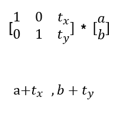

# OpenCV

## 3. 변환, 필터

### 1. 이미지 변환

#### 1-(1) 위치 변경

- `cv2.warpAffine(image, M, dsize)`: 이미지 위치를 변경

  - `M`: 변환 행렬

  - `dsize`: Manual Size

      

  ```python
  import cv2
  import numpy as np
  import matplotlib.pyplot as plt
  
  image = cv2.imread('img/image.jpg')
  
  h,w = image.shape[:2]
  
  M = np.float32([[1,0,200], [0,1,300]]) #tx: 200, ty:300
  dst = cv2.warpAffine(image, M, (w,h)) #w = a, h = b
  
  plt.imshow(cv2.cvtColor(dst, cv2.COLOR_BGR2RGB))
  plt.show()
  ```

   


#### 1-(2) 이미지 회전

 


### 2. 필터

