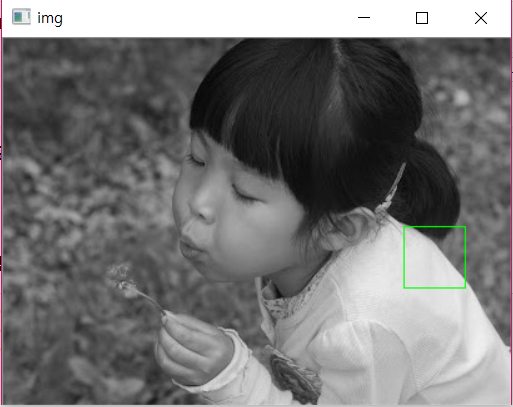

# OpenCV

## 2. 이미지 프로세싱

### 1. 관심영역(ROI) 지정

> roi: 관심영역 (Region Of Interest)

#### 1-(1) 좌표로 ROI 지정

- 관심영역 지정

  ```python
  import cv2
  import numpy as np
  import matplotlib.pyplot as plt 
  
  img = cv2.imread('img/girl.jpg')
  # roi 좌표
  x=320; y=150;w=50;h=50
  # roi 지정
  roi = img[y:y+h; x:x+w]
  
  #roi 전체에 사각형 그리기
  cv2.rectangle(roi, (0,0), (h-1, w-1), (0,255,0))
  cv2.imshow("IMG", img)
  
  cv2.waitKey(0)
  cv2.destroyAllWindows()
  ```

    

- 관심영역 복제 및 새창(roi) 띄우기

  ```python
  
  import cv2
  import numpy as np
  
  img = cv2.imread('img/sunseet.jpg')
  
  x=320; y=150; w=50; h=50
  roi = image[y:y+h, x:x+w]
  img2 = roi.copy()
  
  img[y:y+h, x+w:x+w+w] = roi #태양 2개 만들기
  cv2.rectangle(img, (x,y), (x+w+w, y+h), (0,255,0)) #2개의 태양 영역에 사각형 표시
  
  cv2.imshow("img", img)
  cv2.imshow("roi", img2)
  
  cv2.waitKey(0)
  cv2.destroyAllWindows()
  ```

   


### 1-(2) 마우스 이벤트 코드 없이 간단히 ROI 지정

- `ret = cv2.selectROI([win_name], img, [showCrossHair = True, fromCenter = False])`
  - `win_name`:ROI 선택을 진행할 창의 이름, str
  - `img`: ROI 선택을 진행할 이미지, numpy ndarray
  - `showCrossHair`: 선택 영역 중심에 십자 모양 표시 여부
  - `fromCenter`: 마우스 시작 지점을 영역의 중심으로 지정
  - `ret`: 선택한 좌표와 크기(x,y,w,h) 선택을 취소한 경우 모두 0 - ` c`키를 누르면 선택 취소 

- 마우스로 roi 지정 후 저장

  ```python
  import cv2,  numpy as np
  
  img  = cv2.imread('img/sunhset.jpg')
  
  x,y,w,h = cv2.selectROI('img', img, False)
  #사진을 'img'를 이름으로 갖는 창에 띄워 ROI 지정할 수 있도록 함
  
  if w and h:
      roi = image[y:y+h, x:x+w]
      cv2.imshow('cropped', roi) #선택 영역을 새 창으로 표시
      cv2.moveWindow('cropped',0,0) #'cropped'창을 그림의 (0,0), 즉 왼쪽 상단으로 이동
      cv2.imwrite('cropped2.jpg', roi) # roi 영역만 파일로 저장
  
  cv2.imshow('img', img)
  cv2.waitKey(0)
  cv2.destroyAllWindows()
  ```

  

### 2. 컬러 스페이스

#### 2-(1) RGB, RGBA, HSV

- **RGB(row, column, channel)**

- **RGBA(row, column, channel, alpha): 배경을 투명 처리하는 alpha 채널**

  알파 채널로 전경과 배경을 분리할 수도 있어 **마스크 채널**이라고도 부름

- `img = cv2.imread(file_name, [mode_flag])`: 파일로부터 이미지 읽기

  - mode_flag: 읽기모드 지정

    `cv2.IMREAD_COLOR`: 컬러(BGR)스케일로 읽기

    `cv2.IMREAD_UNCHANGED`: 알파 채널을 가지고 있다면 BGRA로 읽음 

  ```python
  import cv2
  import numpy as np
  import matplotlib.pyplot as plt
  
  # 기본 값 옵션
  img = cv2.imread('img/opencv_logo.png') 
  # IMREAD_COLOR 옵션                   
  bgr = cv2.imread('img/opencv_logo.png', cv2.IMREAD_COLOR)    
  # IMREAD_UNCHANGED 옵션
  bgra = cv2.imread('img/opencv_logo.png', cv2.IMREAD_UNCHANGED)
  
  plt.imshow(cv2.cvtColor(bgr, cv2.COLOR_BGR2RGB))
  plt.show()
  plt.imshow(cv2.cvtColor(bgra, cv2.COLOR_BGR2RGB))
  plt.show()
  plt.imshow(cv2.cvtColor(bgra[:,:,3], cv2.COLOR_BGR2RGB))# 알파 채널만 표시
  plt.show()
  ```

     

- `out = cv2.cvtColor(img, flag)`색상 변경

  - `img`: numpy 배열 이미지

  - `flag`: 변환할 컬러 스페이스(총 274개)

    `cv2.COLOR_BGR2GRAY`: BGRR 컬러를 그레이 스케일로

    `cv2.COLOR_GRAY2BGR`: 그레이 스케일 이미지를 BGR 컬러 이미지로

    `cv2.COLOR_BGR2HSV: BGR 컬러 이미지를 HSV 컬러 이미지로

- **HSV** 

  - H:색조, S:채도, V:명도

    S: 색상의 순수한 정도, 255가 가장 순수한 색

    V: 색상의 명도, 255가 가장 밝음

    **H: 이 값만으로 색상을 확인 -> 색상 기반 작업에 효과적**

  - RGB 색상 범위에 맞는 H값

    RED: 165~180, 0~15

    GREEN: 45~75

    BLUE: 90~120

- BGR에서 HSV로 전환

  ```python
  import cv2
  import numpy as np
  
  red_bgr = np.array([[[0,0,255]]], dtype=np.unit8)
  red_hsv = cv2.cvtColor(red_bgr, cv2.COLOR.BGR2HSV)
  ```

  

#### 2-(2) 이미지 스레시홀딩*

- 바이너리 이미지
  - 검은색과 흰색만으로 표현한 것
  - 원하는 모야야을 좀 더 정확히 판단하게 해줌
  - (0,1) 또는 (0,255) 사용
- 그레이 스케일이미지
  - 0~255 사이의 픽셀로 표현
  - 연산 양을 줄일 때 사용

- **스레시홀딩**: 경계점을 기준으로 해 두 가지 분류로 나누는 것으로 바이너리 이미지를 만드는 가장 대표적 기법

  `ret, out = cv2.threshhold(img, threshold, value, type_flag)`

  - `threshold`: 경계 값

  - `value`: 경계 값 기준에 만족하는 픽셀에 적용할 값

  - `type_flag`: 스레시홀드 적용 방법 지정

    `cv2.THRESH_BINARY`: 픽셀  값이 경계 값을 넘으면 value 값을 지정, 아니면 0 지정

    `cv2.THRESH_BINARY_INV`: `cv2.THRESH_BINARY`의 반대

    `cv2.THRESH_TRUNC`: 픽셀 값이 경계 값을 넘으면 value 값 지정, 아니면 그대로 유지

    `cv2.THRESH_TOZERO`: 픽셀 값이 경계값 넘으면 유지, 아니면 0

    `cv2.THRESH_TOZERO_INV`: `cv2.THRERSH_TOZERO`의 반대

  -  `ret`: 스레시홀딩에 사용한 경계값

  ```python
  import cv2
  import matplotlib.pyplot as plt 
  
  img = cv2.imread('img/man_face.jpg', cv2.IMREAD_GRAYSCALE)
  
  imgs = []
  ret, t_bin = cv2.threshold(img, 127, 255, cv2.THRESH_BINARY)
  ret, t_bininv = cv2.threshold(img, 127, 255, cv2.THRESH_BINARY_INV)
  ret, t_truc = cv2.threshold(img, 127, 255, cv2.THRESH_TRUNC)
  ret, t_2zr = cv2.threshold(img, 127, 255, cv2.THRESH_TOZERO)
  ret, t_2zrinv = cv2.threshold(img, 127, 255, cv2.THRESH_TOZERO_INV)
  imgs.append(t_bin)
  imgs.append(t_bininv)
  imgs.append(t_truc)
  imgs.append(t_2zr)
  imgs.append(t_2zrinv)
  
  for i in imgs:
      plt.imshow(cv2.cvtColor(i, cv2.COLOR_GRAY2RGB))
      plt.show()
  ```

    

   

   

- **적응형 스레시홀드**: method에 띠라 임계값을 결정(전체 픽셀이 하나의 기준이 아니라 영역에 따라 다른 임계값 사용)

  `cv2.adaptiveThreshold(img, value, method, type_flag, block_size, C)`

  - `value`: 경계 값을 만족하는 픽셀에 적용할 값

  - `method`: 경계 값 결정 방법

    `cv2.ADAPTIVE_THRESH_MEAN_C`: 이웃 픽셀의 평균으로 설정

    `cv2.ADAPTIVE_THRESH_GAUSSIAN_C`: 가우시안 분포에 따른 가중치의 합으로 결정

  - `type_flag`: 스레시홀드 적용 방법 지정 (cv2.threshold() 함수와 동일)
  - `block_size`: 영역으로 나눌 이웃의 크기(nxn),  홀수
  - `C`: 계산된 경계 값 결과에서 가감할 상수(음수 가능)

  ```python
  import cv2
  
  image = cv2.imread('img/sudoku.png', cv2.IMREAD_GRAYSCALE)
  
  #cv2.threshold: 경계점을 기준으로 두 가지 분류로 나눔
  ret, th1 = cv2.threshold(image, 127,255, cv2.THRESH_BINARY)
  #image에서 경계값 127을 넘는 픽셀에는 value 값인 255를 지정하고 넘지 못하면 0을 지정
  #ret:스레시홀딩에 사용한 경계값 = 127
  #th1: 결과 바이너리 이미지
  
  #cv2.adaptiveThreshold: 픽셀이 하나의 기준이 아닌 영역에 따라 임계값이 결정됨
  th2 = cv2.adaptiveThreshold(image, 255, cv2.ADAPTIVE_THRESH_MEAN_C, cv2.THRESH_BINARY, 21, 3)
  #image의 경계값을 이웃 픽셀의 평균으로 설정(cv2.ADAPTIVE_THRESH_MEAN_C)하고 경계값을 넘는 픽셀에는 value인 255를 지정하고 넘지 못하면 0을 지정
  #이웃 픽셀은 해당 픽셀의 21x21로 설정 - 숫자가 작아질수록 상대적으로 흐려짐
  #계산된 경계 값 결과에서 3만큼 가감 -숫자가 커질수록 결과물이 깔끔해짐
  
  plt.imshow(cv2.cvtColor(th1, cv2.COLOR_GRAY2RGB))
  plt.show()
  
  plt.imshow(cv2.cvtColor(th2, cv2.COCLOR_GRAY2RGB))
  plt.show()
  ```

   

- 오츠(Otsu) 알고리즘: `ret, t_img = cv2.threshold(img, 0, 255, THRESH_BINARY | cv2.THRESH_OTSU)`

  > 이미지 히스토그램을 이용해 이미지를 두 개의 클래스로 가장 잘 분할할 수 있는 intensity 값이 얼만지 찾는 것
  >
  > 이 값을 Threshold 값으로 해 클래스 1,2로 분류
  >
  > *참고: https://bskyvision.com/49*

  ```python
  import cv2
  import numpy as np
  import matplotlib.pylab as plt
  
  img = cv2.imread('img/scaned_paper.jpg', cv2.IMREAD_GRAYSCALE) 
  _, t_130 = cv2.threshold(img, 130, 255, cv2.THRESH_BINARY)        
  t, t_otsu = cv2.threshold(img, 0, 255,  cv2.THRESH_BINARY | cv2.THRESH_OTSU) 
  # threshold 값을 otsu가 구해주기 때문에 threshold 값에 아무 값이나 넣어도 무관
  print('otsu threshold:', t)    
  
  imgs = {'Original': img, 't:130':t_130, 'otsu:%d'%t: t_otsu}
  #enumerate : 튜플형태로 인덱스번호와 원소를 같이 출력
  for i , (key, value) in enumerate(imgs.items()):
      plt.subplot(1, 3, i+1)
      plt.title(key)
      plt.imshow(value, cmap='gray')
      plt.xticks([]); plt.yticks([]) 
  
  plt.show()
  ```

  

### 3. 이미지 연산

#### 3-(1) 픽셀

- 이미지 정보 확인

  - `image.shape`: 이미지 크기 확인

  - `image.size`: 이미지 픽셀 수 확인

  - `image[x,y]`: (x,y) 위치의 픽셀 정보를 알려줌 - 출력시 B, G, R 순서로 출력

    index 0: B 값, 1:G 값, 2: R값

- 픽셀 값 바꿔보기

  ```python
  import cv2
  import numpy as np
  import matplotlib.pyplot as plt
  
  #h 480, w 640에 3개의 채널을 갖는 흰 배경 만들기
  image = np.full((480,640,3), 255, np.uint8)
  
  # 빨간 배경 만들기
  image2 = np.full((480,640,3), (0,0,255), np.unit8)
  
  # image2 검은 배경으로 만들기
  image2.fill(0)
  
  #image2에서 3개의 픽셀 값을 검은 색에서 흰 색으로 변경하기
  image2[240,160] = image2[240,320] = image2[240,480] = (255,255,255)
  
  #w,h 전체에 대해 픽셀값 중 [0]인 B값을 파란색으로 변경
  image2[:,:,0] = 255
  
  #배경 중간에 흰색 세로선 긋기 - 흰색이려면 RGB 모두 255여야 함
  image2[:, 320,:] = 255
  ```

  

#### 3-(2) 색상 다루기

- 이미지의 픽셀값을 변경

  ```python
  import cv2
  import matplotlib.pyplot as plt 
  
  image = cv2.imread('img/image.jpg')
  image[:,:,2] = 0
  
  plt.imshow(cv2.cvtColor(image, cv2.COLOR_BGR2RGB))
  plt.show()
  ```

   

- 이미지에서 특정 부분 픽셀값 변경

  ```python
  import cv2
  import matplotlib.pyplot as plt 
  
  image = cv2.imread('img/image.jpg')
  
  roi = image[300:700, 300:700]
  roi[:,:,2] = 0
  
  plt.imshow(cv2.cvtColor(image, cv2.COLOR_BGR2RGB))
  plt.show()
  ```

   


#### 3-(3) 사이즈

- 이미지 사이즈 변경: `cv2.resize(image, (w,h), fx, fy, interpolation)`

  - `(w,h)`: 사이즈를 지정

  - `fx, fy`: 가로 비율과 세로 비율 지정

  - `interpolation`: 보간법 - 사이즈가 변할 때 픽셀 사이의 값을 조절하는 방법을 의미

    `INTER_CUBIC`: 사이즈 확대에 주로 사용

    `INTER_AREA`: 사이즈 축소에 주로 사용

- 가로, 세로 길이를 지정해 resize

  ```python
  import matplotlib.pyplot as plt
  import cv2
  
  img = cv2.imread("img/girl.jpg")
  
  #img를 w300 h600의 크기로 변경
  im2 = cv2.resize(img, (600,300))
  ```

- 가로, 세로의 비율을 조정해 resize

  ```python
  import cv2 
  import matplotlib.pyplot as plt 
  
  image = cv2.imread('img/image.jpg')
  
  #img를 wx2, hx2만큼 확대
  im2 = cv2.resize(img, fx=2.0, fy=2.0, interpolation = INTER_CUBIC)
  
  #img를 wx0.8, hx0.8만큼 축소
  im3 = cv2.resize(img, fx=0.8, fy=0.8, interpolation = INTER_AREA)
  ```

- 이미지 자르기

  ```python
  import matplotlib.pyplot as plt
  import cv2
  
  img = cv2.imread("img/girl.jpg")
  
  #img의 일부분만 crop
  im2 = img[0:200, 100:500]
  ```


#### 4. 이미지 합치기

#### 4-(1) 단순한 합치기: add

- `dest = cv2.add(src1, src2, [dest, mask, dtype])`: src1과 src2 더하기 - add 함수는 연산 시 255를 넘는 경우 거뭇거리거나, 하얗게 날아간 것처럼 보임

  - `src`: 입력 영상/이미지
  - `dest`: 출력 영상
  - `mask`: 0이 아닌 픽셀만 연산
  - `dtype`: 출력 dtype

  ```python
  import cv2
  import matplotlib.pyplot as plt
  
  image_1 = cv2.imread('img/man_face.jpg')
  image_2 = cv2.imread('img/lion_face.jpg')
  
  result1 = cv2.add(image_1, image_2)
  plt.imshow(cv2.cvtColor(result1, cv2.COLOR_BGR2RGB))
  plt.show()
  
  result2 = image_1 + image_2
  plt.imshow(cv2.cvtColor(result2, cv2.COLOR_BGR2RGB))
  plt.show()
  ```

   


#### 4-(2) 알파블렌딩

- `cv2.addWeight(img1, alpha, img2, beta, gamma)`

  - `alpha`: img1에 지정할 가중치
  - `beta`: img2에 지정할 가중치 (주로 1-alpha)
  - `gamma`: 연산 결과에 가감할 상수 (주로 0) - 클수록 색이 하얗게 됨

  ```python
  import cv2
  import matplotlib.pyplot as plt
  
  img1 = cv2.imread('img/man_face.jpg')
  img2 = cv2.imread('img/lion_face.jpg')
  
  alpha = 0.5
  dst = cv2.addWeight(img1, alpha, img2, (1-alpha), 0)
  
  plt.imshow(cv2.cvtColor(dst, cv2.COLOR_BGR2RGB))
  plt.show()
  ```

   

- 트랙바 적용하기

  ```python
  import cv2
  import numpy as np
  
  win_name = 'Alpha blending'     # 창 이름
  trackbar_name = 'fade'          # 트렉바 이름
  
  def onChange(x):
      alpha = x/100
      dst = cv2.addWeighted(img1, 1-alpha, img2, alpha, 0) 
      cv2.imshow(win_name, dst)
      
  img1 = cv2.imread('img/man_face.jpg')
  img2 = cv2.imread('img/lion_face.jpg')
  
  cv2.imshow(win_name, img1)
  cv2.createTrackbar(trackbar_name, win_name, 0, 100, onChange)
  cv2.waitKey()
  cv2.destroyAllWindows()
  ```

   


