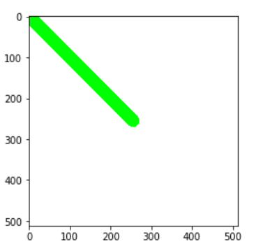
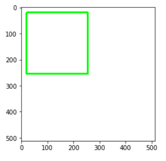
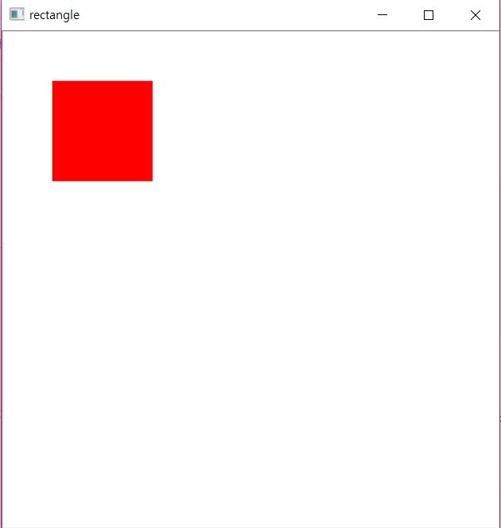
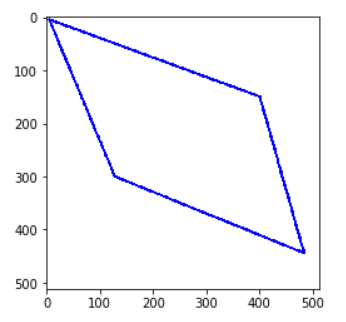
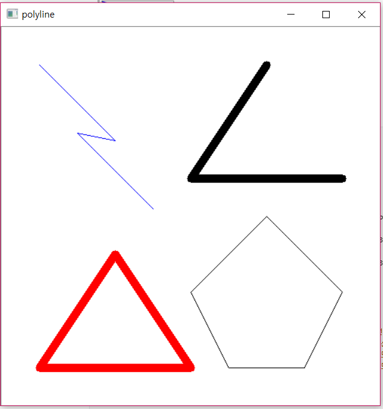
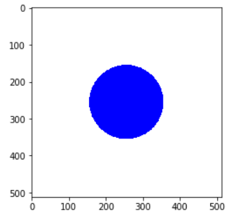
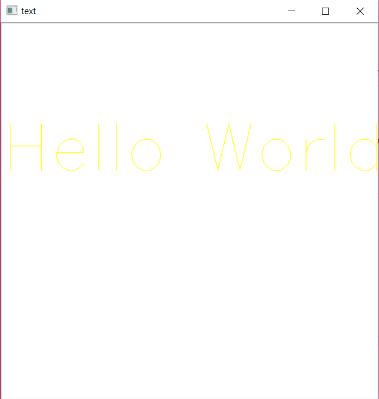
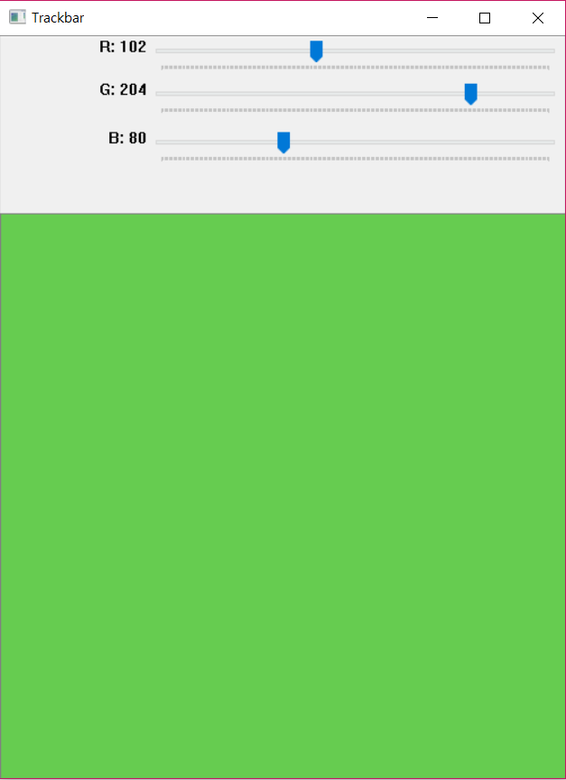

# OpenCV

## 1. 기본입출력

> **OpenCV**
>
> - 영상 처리와 컴퓨터 비전을 위한 오픈소스 라이브러리
> - C, C++, Python 등에서 사용 가능
> - 파이썬 버전 2.7과 3.x에 따른 지원에 차이가 거의 없음

- openCV 설치

  ```python
  !pip install opencv-python
  ```

  

### 1. 기본 입출력

#### 1-(1) 이미지, 비디오 입출력

- 새 창에 이미지 띄우기

  ```python
  import cv2
  
  img_file = 'img/girl.jpg'
  img = cv2.imread(img_file)
  
  cv2.imshow('IMG', img)
  cv2.waitKey()
  cv2.destroyAllWindows()
  ```

  - `cv.imread(file_name, [mode_flag])`:  파일로부터 이미지 읽기

    mode_flag = cv2.IMREAD_COLOR: 읽기모드 지정

    * cv2.IMREAD_COLOR: 컬러(BGR)스케일로 읽기 [default]
    * cv2.IMREAD_UNCHANGED: 파일 그대로 읽기
    * **cv2.IMREAD_GRAYSCALE: 그레이(흑백) 스케일로 읽기** 

  - `cv2.imshow(title, image파일)`: 이미지를 'title' 이름의 창에 띄움 

  - `cv2.waitKey(time)`

    time: 입력 대기 시간, 0은 무한대기

    사용자가 어떤 키를 입력했을 때 아스키 코드로 반환 (esc:27)

    time 인자값이 없을 경우 아무키나 입력해도 창이 닫힘

  - `cv2.destroyAllWindow()`: 화면의 모든 윈도우를 닫는 함수

- jupyter notebook에 이미지로 바로 나타내기

  ```python
  import matplotlib.pyplot as plt
  import cv2
  
  img = cv2.imread('img/girl_face.jpg')
  
  plt.axis('off') #축 off - 꺼주지 않으면 가로 세로에 축이 나옴
  plt.imshow(cv2.cvtColor(img, cv2.COLOR_BGR2RGB))
  #openCV는 RGB가 아닌 BGR을 사용 -> 그래서 BGR을 RGB로 변경해주어야 볼 수 있음
  plt.show()
  ```

- 그레이 스케일로 읽기

  ```python
  import matplotlib.pyplot as plt
  import cv2
  
  img_file = 'img/image.jpg'
  img = cv2.imread(img_file, cv2.IMREAD_GRAYSCALE) #그레이스케일
  
  plt.axis('off')
  plt.imshow(cv2.cvtColor(img, cv2.COLOR_BGR2RGB))
  plt.show()
  ```


#### 1-(2) 이미지 저장하기

- 경로에 파일 저장

  ```python
  import cv2
  
  img_file = 'img/image.jpg'
  cv2.imwrite('img/image_gray.jpg', img_file)
  ```
  - cv2.imwrite(file_path, img)`: 파일 경로에 이미지파일을 저장


#### 1-(3) 예제

1. 컬러이미지를 윈도우 이미지로 열기

2. 저장 후 아무 키나 눌러서 닫기

3. 흑백사진으로 열기. 아무 키나 눌러서 닫기

   ```python
   import cv2
   
   #컬러 이미지를 윈도우 이미지로 열기
   img = 'img/house.jpg'
   img1 = cv2.imread(img, cv2.IMREAD_COLOR)
   cv2.imshow('IMG', img)
   cv2.waitKey()
   cv2.destroyAllWindows()
   
   #저장
   cv2.imwrite('img/house_color.jpg', img1)
   
   #흑백사진으로 열기
   img2 = cv2.imread(img, cv2.IMREAD_GRAYSCALE)
   cv2.imshow('IMG', img2)
   cv2.waitKey()
   cv2.destroyAllWindows()
   ```

   

### 2. 동영상 및 카메라 프레임

#### 2-(1) 동영상 파일 읽기

```python
import cv2

video_file = 'img/big_buck.avi'

cap = cv2.VideoCapture(video_file) # 객체 생성

if cap.isOpened(): #객체 초기화 확인
    while True: #video 파일은 img가 연속된 것. 그래서 frame을 계속 읽어주기 위해 while true 설정
        ret, img = cap.read() 
        if ret:
            cv2.imshow(video_file, img) #프레임 표시 
            cv2.waitKey(10) #다음 프레임을 몇 초 뒤에 읽을 것인지 - 초를 늘리면 느려짐
        else:
            break
else:
    print('동영상을 열 수 없습니다.')
cap.release()
cv2.destroyAllWindows()
```


#### 2-(2) 프레임 스트림 프로퍼티 얻기

- `cv2.CAP_PROP_FRAME_WIDTH` : 프레임 폭

- `cv2.CAP_PROP_FRAME_HEIGHT` : 프레임 높이

- `cv2.CAP_PROP_FPS` : 프레임 초당 프레임 수 

- `cv2.CAP_PROP_POS_MSEC` : 동영상 파일의 프레임 위치(MS)

- `cv2.CAP_PROP_POS_AVI_RATIO` : 동영상 파일의 상대 위치 (0:시작 , 1:끝)

  ```python
  import cv2
  
  def print_capture_properties(*args): #*args: 함수에 들어오는 인자가 몇 개인지 모를 때
      capture = cv2.VideoCapture(*args)
      print('Frame Count:', int(capture.get(cv2.CAP_PROP_FRAME_COUNT)))
      print('Frame Width:', int(capture.get(cv2.CAP_PROP_FRAME_WIDTH)))
      print('Frame Height:', int(capture.get(cv2.CAP_PROP_FRAME_HEIGHT)))
      print('Frame Rate:', int(capture.get(cv2.CAP_PROP_FPS)))
  
  print_capture_properties("img/big_buck.avi")
  ```


#### 2-(3) 비디오 파일에서 n번째 프레임 가져오기

- 100번째 프레임

  ```python
  import cv2
  
  capture = cv2.VideoCapture('img/big_buck.avi')
  frame_count = int(capture.get(cv2.CAP_PROP_FRAME_COUNT))
  print('Frame Count:', frame_count)
  
  #100번째 프레임
  capture.set(cv2.CAP_PROP_POS_FRAMES, 100)
  capture, frame = capture.read()
  cv2.imshow('frame100', frame)
  
  cv2.waitKey()
  cv2.destroyAllWindows()
  ```

  - `cap.set(id, value)`: 프로퍼티 변경
  - `cap.get(id)`: 프로퍼티 확인
  - `cv2.CAP_PROP_POS_FRAMES`: 현재 프레임 개수


### 3. 그림 그리기

#### 3-(1) 선 그리기

- 직선 그리기: `cv2.line(img, start, end, color, [thickness, lineType])`
  
  ```python
  import cv2
  import matplotlib.pyplot as plt
  import numpy as np
  
  #가로 512 세로 512인 3개의 층을 만듦
  image = np.full((512, 512, 3), 255, np.uint8)
  
  #(0,0)에서 (255,255)까지 LINE_4형식 선으로 두께 30만큼 그리기
  image = cv2.line(image, (0,0), (255, 255), (0,255,0), 30, cv2.LINE_4)
  
  plt.imshow(image)
  plt.show
  ```
  
   


#### 3-(2) 사각형 그리기

- 간단한 사각형1: `cv2.rectangle(img, start, end, color, [thickness, lineType])`

  테두리만 있는 사각형

  ```python
  import cv2
  import numpy as np
  import matplotlib.pyplot as plt
  
  image = np.full((512,512,3), 255, np.uint8)
  
  image = cv2.rectangle(image, (0,0), (255,255), (0,255,0),5)
  
  plt.imshow(image)
  plt.show()
  ```

   

- 간단한 사각형2

  안이 채워져 있는 사각형: **thickness를 -1로 설정**

  ```python
  import cv2
  
  #비어있는 image를 만들지 않고 불러올 수도 있음 
  img = cv2.imread('img/blank_500.jpg')
  
  cv2.rectanle(img, (50,50), (150,150), (0,0,255), -1)
  
  cv2.imshow('rectangle', img)
  cv2.waitKey()
  cv2.destroyAllWindows()
  ```

    

  

#### 3-(3) 다각형 그리기

- 다각형1: `cv2.polylines(img, points, isClosed, color, [thickness, lineType])`

  - `points`: 꼭지점 좌표
  - `isClosed`: 닫힌 도형 여부 - True / False

   ```python
  import cv2
  import numpy as np
  import matplotlib.pyplot as plt
  
  image = np.full((512,512,3), 255, np.uint8)
  points = np.array([5,5], [128,300], [483,444], [400,150])
  image = cv2.polyline(image, [points], True, (0,0,255), 4)
  
  plt.imshow(image)
  plt.show()
   ```

   

- 다각형2

  열린 도형과 닫힌 도형 간 비교 확인

  ```python
  import cv2
  import numpy as np                         
  
  img = cv2.imread('img/blank_500.jpg')
  
  # Numpy array로 좌표 생성 ---②
  # 번개 모양 선 좌표
  pts1 = np.array([[50,50], [150,150], [100,140],[200,240]], dtype=np.int32) 
  # 삼각형 좌표
  pts2 = np.array([[350,50], [250,200], [450,200]], dtype=np.int32) 
  # 삼각형 좌표
  pts3 = np.array([[150,300], [50,450], [250,450]], dtype=np.int32) 
  # 5각형 좌표
  pts4 = np.array([[350,250], [450,350], [400,450], [300,450], [250,350]],dtype=np.int32) 
  
  # 다각형 그리기 ---③
  cv2.polylines(img, [pts1], False, (255,0,0))       # 번개 모양 선 그리기
  cv2.polylines(img, [pts2], False, (0,0,0), 10)     # 3각형 열린 선 그리기 
  cv2.polylines(img, [pts3], True, (0,0,255), 10)    # 3각형 닫힌 도형 그리기 
  cv2.polylines(img, [pts4], True, (0,0,0))          # 5각형 닫힌 도형 그리기
  
  cv2.imshow('polyline', img)
  cv2.waitKey(0)
  cv2.destroyAllWindows()
  ```

    

  

### 3-(4) 원 그리기

- 간단한 원 그리기: `cv2.cirgle(img, center, radius, color, [thickness, lineType])`

  ```python
  import cv2
  import numpy as np
  import matplotlib.pyplot as plt
  
  image = cv2.imread('img/blank_500.jpg')
  image = cv2.cirgle(image, (255,255), 100, (255,0,0), -1)
  
  plt.imshow(image)
  plt.show()
  ```

    


#### 3-(5) 텍스트

- image에 텍스트 넣기: `cv2.putText(image, text, position, font_type, font_scale, color)`

  - `position`: 텍스트가 출력될 위치
  - `font_type`: 글씨체
  - `font_scale`: 글씨체 가중치

  ```python
  import cv2
  import matplotlib.pyplot as plt
  import numpy as np
  
  image = np.full((512,512,3), 255, np.unit8)
  image = cv2.putText(image, 'Hello World', (0,200), cv2.FONT_ITALIC, 3, (0,255,255))
  
  cv2.imshow('text', image)
  cv2.waitKey()
  cv2.destroyAllWindows()
  ```

   


### 4. 창 관리 및 사용자 입력 처리

#### 4-(1) 창관리

- `cv2.nameWindow(title, [option])`: 이름을 'title'로 갖는 창 열기

  - option: 창 옵션

    `cv2.WINDOW_NORMAL`: 임의의 크기, 창 크기 조절 가능

    `cv2.WINDOW_AUTOSIZE`: 이미지와 같은 크기, 창 크기 재조정 불가능

- `cv.moveWindow(title, x좌표, y좌표)`: 창 위치 이동
- `cv.resizeWindow(title, width, height)`: 창 크기 변경
- `cv2.destroyWindow(title)`: 창 닫기
- `cv2.destroyAllWindows()`: 열린 모든 창 닫기


#### 4-(2) 사용자의 키보드 입력 처리하기

- 창 위치를 키보드를 통해 변경

  - 윈도우 wasd 키로 상하좌우 이동
  - q, esc 누르면 종료

  ```python
  import cv2
  
  img_file = "img/actor.jpg"
  timg = cv2.imread(img_file)
  title = 'IMG'
  x, y = 100, 100
  
  while True:
      cv2.imshow(title, img)
      cv2.moveWindow(title, x, y)
      key = cv2.waitKey(0)
      #해당 시간 동안 프로그램을 멈추고 대기하다 키보드에 눌린 키에 대응하는 아스키 코드 값 반환
      #0은 무한대
      
      if key == ord('a'):
          x -= 10
          
      elif key == ord('s'):
          y += 10
          
      elif key == ord('w'):
          y -= 10   
          
      elif key == ord('d'):
          x += 10 
          
      elif key == ord('q') or key == 27: #q(uit)의 아스키가 27
          break
          
  cv2.destroyAllWindows()
  ```

  

#### 4-(3) 사용자의 마우스 입력 처리하기

- `cv2.setMouseCallback(win_name, onMouse [, param]) `: win_name에 onMouse 함수를 등록
  - `win_name`: 이벤트를 등록할 윈도 이름
  - `onMouse`: 이벤트 처리를 위해 미리 선언해 놓은 콜백 함수
  - `param`: 필요에 따라 onMouse 함수에 전달할 인자

- **MouseCallback(event, x, y, flags, param): 콜백 함수 선언부**
  - `event` : 마우스 이벤트 종류

    cv2.EVENT_MOSEMOVE : 마우스 움직임

    cv2.EVENT_LBUTTONDOWN : 왼쪽 버튼 누름

    cv2.EVENT_RBUTTONDOWN : 오른쪽 버튼 누름 

    cv2.EVENT_MBUTTONDOWN : 가운데 버튼 누름

    cv2.EVENT_LBUTTONDUP : 왼쪽 버튼 뗌

    cv2.EVENT_RBUTTONUP : 오른쪽 버튼 뗌 

    cv2.EVENT_MBUTTONUP : 가운데 버튼 뗌

    cv2.EVENT_LBUTTONDBLCLK: 왼쪽 버튼 더블클릭

    cv2.EVENT_RBUTTONDBLCLK : 오른쪽 버튼 더블클릭

    cv2.EVENT_MBUTTONDBLCLK : 가운데 버튼 더블클릭

    cv2.EVENT_MOUSEWHEEL : 휠 스크롤

    cv2.EVENT_MOUSEWHEEL : 휠 가로 스크롤 

  - `x, y`: 마우스 좌표

  - `flags`: 마우스 동작과 함께 일어난 상태

    cv2.EVENT_LBUTTONDOWN(1) : 왼쪽 버튼 누름

    cv2.EVENT_RBUTTONDOWN(2) : 오른쪽 버튼 누름

    cv2.EVENT_MBUTTONDOWN(4) : 가운데 버튼 누름

    cv2.EVENT_FLAG_CTRLKEY(8) : Ctrl 키 누름

    cv2.EVENT_FLAG_SHIFTKEY(16) : Shift 키 누름

    cv2.EVENT_FLAG_ALTKEY(32) : Alt 키 누름

  - `param`: `cv2.setMouseCallback()` 함수에서 전달한 인자

- 마우스 이벤트로 동그라미 그리기

  ```python
  import cv2
  
  window = 'mouse event'
  img = cv2.imread('img/blank_500.jpg')
  cv2.imshow(window, img)
  
  def onMouse(event, x, y, flags, param):
      if event == cv2.EVENT_LBUTTONDOWN:
          cv2.circle(img, (x,y), 30, (0,0,0), -1)
          cv2.imshow(window, img)
  
  cv2.setMouseCallback(window, onMouse)
  
  while True:
      if cv2.waitKey(0) & 0xFF == 27:
          break
  cv2.destroyAllWindows()
  ```

- 플래그 이용한 동그라미 그리기

  ```python
  import cv2
  
  window = 'mouse event'
  img = cv2.imread('img/blank_500.jpg')
  cv2.imshow(window, img)
  
  colors = {'black':(0,0,0),
           'red':(0,0,255),
           'blue':(255,0,0),
            'green':(0,255,0)}
  
  
  def onMouse(event, x, y, flags, param):
      color = colors['black']
      if event == cv2.EVENT_LBUTTONDOWN:
          if flags & cv2.EVENT_FLAG_CTRLKEY:
              color = colors['blue']
          elif flags & cv2.EVENT_FLAG_SHIFTKEY:
              color = colors['red']
          if flags & cv2.EVENT_FLAG_CTRLKEY and flags & cv2.EVENT_FLAG_SHIFTKEY:
              color = colors['green']
              
          cv2.circle(img, (x,y), 30, color, -1)
          cv2.imshow(window, img)
      
  cv2.setMouseCallback(window, onMouse)
  
  while True:
      if cv2.waitKey(0) & 0xFF == 27:
          break
  cv2.destroyAllWindows()
  ```


### 5. 트랙바

#### 5-(1) 트랙바를 이용한 이미지 색 조정

- `cv2.createTrackbar(trackbar_name, win_name, value, count, onChange)`: 트랙바 생성
  - `trackbar_name`: 트랙바 이름
  - `value`: 트랙바 초기 값, 0~count 사이의 값
  - `count`: 트랙바 눈금 수, 트랙바가 표시할 수 있는 최대 값
  - `onChange`: 트랙바 이벤트 핸들러 함수

- `TrackbarCallback(value)`: 트랙바 이벤트 핸들러 함
  - `value`: 트랙바가 움직인 새 위치 값

- `pos = cv2.getTrackbarPos(trackbar_name, win_name)`

  - `pos`: 트랙바 위치 값

  ```python
  import cv2
  
  win_name = 'Trackbar'
  
  img = cv2.imread('img/blank_500.jpg')
  cv2.imshow(win_name, img)
  
  def onChange(x):
      r = cv2.getTrackbarPos('R', win_name)
      g = cv2.getTrackbarPos('G', win_name)
      b = cv2.getTrackbarPos('B', win_name)
      img[:] = [b,g,r]
      cv2.imshow(win_name, img)
      
  cv2.createTrackbar('R', win_name, 255,255,onChange)
  cv2.createTrackbar('G', win_name, 255,255,onChange)
  cv2.createTrackbar('B', win_name, 255,255,onChange)
  
  while True:
      if cv2.waitKey(1) & 0xFF == 27:
          break
  cv2.destroyAllWindows()
  ```

    


